<h1 align="center">Informe de Trabajo Final</h1>
<strong>Universidad Peruana de Ciencias Aplicadas</strong><br>
<br><strong>Ingeniería de sistemas y Computación | Ingeniería de software</strong>

<!--Logo UPC-->
<p align="center">
    </img>
</p>

<!--Profesor, seccion, etc-->
<p align="left">
    <strong>Docente: </strong>Alex Humberto Sánchez Ponce<br><!--El br es para el salto de línea-->
    <strong>Sección: </strong>4364<br>
    <strong>Ciclo: </strong>2025 - 1<br>
    <strong>Startup: </strong>Café Metrix<br>
    <strong>Producto: </strong>Café Lab
</p>

<!--Aplicaciones Web-->
<h1 align="center">APLICACIONES WEB</h1>

<!--Nombres de integrantes-->
<div style="text-align:center;">
    <h3><p align="center">Integrantes del equipo:</p></h3>
    <table align="center" border="1" cellpadding="8" cellspacing="0" style="border-collapse: collapse;">
        <tr>
            <th style="text-align:center; border: 1px solid #ddd;">Nombres y Apellidos</th>
            <th style="text-align:center; border: 1px solid #ddd;">Código</th>
        </tr>
        <tr>
            <td style="border: 1px solid #ddd;">Renzo Sebastian Uribe Livia</td>
            <td style="border: 1px solid #ddd;">U202311745</td>
        </tr>
        <tr>
            <td style="border: 1px solid #ddd;">Joseph Manuel Chavez Viera</td>
            <td style="border: 1px solid #ddd;">U202314019</td>
        </tr>
        <tr>
            <td style="border: 1px solid #ddd;">Adrian Ricardo Donayre Alvarez</td>
            <td style="border: 1px solid #ddd;">U202310187</td>
        </tr>
        <tr>
            <td style="border: 1px solid #ddd;">Christian Fabrizio Inga Orihuela</td>
            <td style="border: 1px solid #ddd;">U20231C111</td>
        </tr>
        <tr>
            <td style="border: 1px solid #ddd;">Carlos Fredy Fernandez Camayo</td>
            <td style="border: 1px solid #ddd;">U202320083</td>
        </tr>
    </table>
</div>

<!--FECHA QUE SE MODIFICA-->
<div align="center" style="font-weight: bold;">24 DE ABRIL DE 2025</div><br>

<!--Registro de versiones-->
<h1 align="left">Registro de versiones del Informe</h1>
</br>
<table border="1" cellpadding="10" cellspacing="0" style="border-collapse: collapse; width: 100%;">
  <tr>
    <td align="center" style="border: 1px solid #ddd; padding: 8px;">Versión</td>
    <td align="center" style="border: 1px solid #ddd; padding: 8px;">Fecha</td>
    <td align="center" style="border: 1px solid #ddd; padding: 8px;">Autores</td>
    <td align="center" style="border: 1px solid #ddd; padding: 8px;">Descripción</td>
  </tr>
  <tr>
    <td style="border: 1px solid #ddd; padding: 8px;">TB1</td>
    <td style="border: 1px solid #ddd; padding: 8px;">24/04/2025</td>
    <td style="border: 1px solid #ddd; padding: 8px;">
      <ul>
        <li>Renzo Uribe</li>
        <li>Joseph Chavez</li>
        <li>Adrian Donayre</li>
        <li>Christian Inga</li>
        <li>Carlos Fernandez</li>
      </ul>
    </td>
    <td style="border: 1px solid #ddd; padding: 8px;">            
      <ul>
        <li>Capítulo I: Introducción</li>
        <li>Capítulo II: Requirements Elicitation & Analysis</li>
        <li>Capítulo III: Requirements Specification</li>
        <li>Capítulo IV: Product Design</li>
        <li>Capítulo V: Product Implementation, Validation & Deployment hasta el primer sprint</li>
        <li>Avance de Conclusiones, Bibliografía y Anexos</li>
      </ul>
    </td>
  </tr>
</table><br>

<!--Link al repositorio en la organización-->
# Project Report Collaboration Insights
Link de repositorio del reporte: [https://github.com/upc-pre-202510-1asi0730-4364-CafeMetrix/cafeLab](https://github.com/upc-pre-202510-1asi0730-4364-CafeMetrix/cafeLab)

<h1>TB1</h1>

<p>Para el desarrollo del informe perteneciente a la entrega TB1, se dividió la implementación de secciones de la siguiente forma para cada integrante del equipo:</p>

<table align="center" border="1" cellpadding="10" cellspacing="0" style="border-collapse: collapse; width: 100%;">
  <tr>
    <td align="center" style="border: 1px solid #ddd; padding: 8px;">Integrante</td>
    <td align="center" style="border: 1px solid #ddd; padding: 8px;">Tareas Asignadas</td>
  </tr>
  <tr>
    <td style="border: 1px solid #ddd; padding: 8px;">Renzo Uribe</td>
    <td style="border: 1px solid #ddd; padding: 8px;"></td>
  </tr>
  <tr>
    <td style="border: 1px solid #ddd; padding: 8px;">Joseph Chavez</td>
    <td style="border: 1px solid #ddd; padding: 8px;"></td>
  </tr>
  <tr>
    <td style="border: 1px solid #ddd; padding: 8px;">Adrian Donayre</td>
    <td style="border: 1px solid #ddd; padding: 8px;"></td>
  </tr>
  <tr>
    <td style="border: 1px solid #ddd; padding: 8px;">Christian Inga</td>
    <td style="border: 1px solid #ddd; padding: 8px;"></td>
  </tr>
  <tr>
    <td style="border: 1px solid #ddd; padding: 8px;">Carlos Fernandez</td>
    <td style="border: 1px solid #ddd; padding: 8px;"></td>
  </tr>
</table>

<!--ÍNDICE-->
# Contenido
[Student Outcome](#student-outcome)

[Capítulo I: Introducción](#capítulo-i-introducción)
- [1.1. Startup Profile](#11-startup-profile)
  - [1.1.1. Descripción de la Startup](#111-descripción-de-la-startup)
  - [1.1.2. Perfiles de integrantes del equipo](#112-perfiles-de-integrantes-del-equipo)
- [1.2. Solution Profile](#12-solution-profile)
  - [1.2.1 Antecedentes y problemática](#121-antecedentes-y-problemática)
  - [1.2.2 Lean UX Process](#122-lean-ux-process)
    - [1.2.2.1. Lean UX Problem Statements](#1221-lean-ux-problem-statements)
    - [1.2.2.2. Lean UX Assumptions](#1222-lean-ux-assumptions)
    - [1.2.2.3. Lean UX Hypothesis Statements](#1223-lean-ux-hypothesis-statements)
    - [1.2.2.4. Lean UX Canvas](#1224-lean-ux-canvas)
- [1.3. Segmentos objetivo](#13-segmentos-objetivo)
- [Capítulo II: Requirements Elicitation \& Analysis](#capítulo-ii-requirements-elicitation--analysis)
  - [2.1. Competidores](#21-competidores)
    - [2.1.1. Análisis competitivo](#211-análisis-competitivo)
    - [2.1.2. Estrategias y tácticas frente a competidores](#212-estrategias-y-tácticas-frente-a-competidores)
  - [2.2. Entrevistas](#22-entrevistas)
    - [2.2.1. Diseño de entrevistas](#221-diseño-de-entrevistas)
    - [2.2.2. Registro de entrevistas](#222-registro-de-entrevistas)
    - [2.2.3. Análisis de entrevistas](#223-análisis-de-entrevistas)
  - [2.3. Needfinding](#23-needfinding)
    - [2.3.1. User Personas](#231-user-personas)
    - [2.3.2. User Task Matrix](#232-user-task-matrix)
    - [2.3.3. User Journey Mapping](#233-user-journey-mapping)
    - [2.3.4. Empathy Mapping](#234-empathy-mapping)
    - [2.3.5. As-is Scenario Mapping](#235-as-is-scenario-mapping)
  - [2.4. Ubiquitous Language](#24-ubiquitous-language)
- [Capítulo III: Requirements Specification](#capítulo-iii-requirements-specification)
  - [3.1. To-Be Scenario Mapping](#31-to-be-scenario-mapping)
  - [3.2. User Stories](#32-user-stories)
  - [3.3. Impact Mapping](#33-impact-mapping)
  - [3.4. Product Backlog](#34-product-backlog)
- [Capítulo IV: Product Design](#capítulo-iv-product-design)
  - [4.1. Style Guidelines](#41-style-guidelines)
    - [4.1.1. General Style Guidelines](#411-general-style-guidelines)
    - [4.1.2. Web Style Guidelines](#412-web-style-guidelines)
  - [4.2. Information Architecture](#42-information-architecture)
    - [4.2.1. Organization Systems](#421-organization-systems)
    - [4.2.2. Labeling Systems](#422-labeling-systems)
    - [4.2.3. SEO Tags and Meta Tags](#423-seo-tags-and-meta-tags)
    - [4.2.4. Searching Systems](#424-searching-systems)
    - [4.2.5. Navigation Systems](#425-navigation-systems)
  - [4.3. Landing Page UI Design](#43-landing-page-ui-design)
    - [4.3.1. Landing Page Wireframe](#431-landing-page-wireframe)
    - [4.3.2. Landing Page Mock-up](#432-landing-page-mock-up)
  - [4.4. Web Applications UX/UI Design](#44-web-applications-uxui-design)
    - [4.4.1. Web Applications Wireframes](#441-web-applications-wireframes)
    - [4.4.2. Web Applications Wireflow Diagrams](#442-web-applications-wireflow-diagrams)
    - [4.4.2. Web Applications Mock-ups](#442-web-applications-mock-ups)
    - [4.4.3. Web Applications User Flow Diagrams](#443-web-applications-user-flow-diagrams)
  - [4.5. Web Applications Prototyping](#45-web-applications-prototyping)
  - [4.6. Domain-Driven Software Architecture](#46-domain-driven-software-architecture)
    - [4.6.1. Software Architecture Context Diagram](#461-software-architecture-context-diagram)
    - [4.6.2. Software Architecture Container Diagrams](#462-software-architecture-container-diagrams)
    - [4.6.3. Software Architecture Components Diagrams](#463-software-architecture-components-diagrams)
  - [4.7. Software Object-Oriented Design](#47-software-object-oriented-design)
    - [4.7.1. Class Diagrams](#471-class-diagrams)
    - [4.7.2. Class Dictionary](#472-class-dictionary)
  - [4.8. Database Design](#48-database-design)
    - [4.8.1. Database Diagram](#481-database-diagram)
- [Capítulo V: Product Implementation, Validation \& Deployment](#capítulo-v-product-implementation-validation--deployment)
  - [5.1. Software Configuration Management](#51-software-configuration-management)
    - [5.1.1. Software Development Environment Configuration](#511-software-development-environment-configuration)
    - [5.1.2. Source Code Management](#512-source-code-management)
    - [5.1.3. Source Code Style Guide \& Conventions](#513-source-code-style-guide--conventions)
    - [5.1.4. Software Deployment Configuration](#514-software-deployment-configuration)
  - [5.2. Landing Page, Services \& Applications Implementation](#52-landing-page-services--applications-implementation)
    - [5.2.1. Sprint 1](#521-sprint-1)
      - [5.2.1.1. Sprint Planning 1](#5211-sprint-planning-1)
      - [5.2.1.2. Aspect Leaders and Collaborators](#5212-aspect-leaders-and-collaborators)
      - [5.2.1.3. Sprint Backlog n.](#5213-sprint-backlog-n)
      - [5.2.1.4. Development Evidence for Sprint Review](#5214-development-evidence-for-sprint-review)
      - [5.2.1.5. Execution Evidence for Sprint Review](#5215-execution-evidence-for-sprint-review)
      - [5.2.1.6. Services Documentation Evidence for Sprint Review](#5216-services-documentation-evidence-for-sprint-review)
      - [5.2.1.7. Software Deployment Evidence for Sprint Review](#5217-software-deployment-evidence-for-sprint-review)
      - [5.2.1.8. Team Collaboration Insights during Sprint](#5218-team-collaboration-insights-during-sprint)
  - [5.3. Validation Interviews](#53-validation-interviews)
    - [5.3.1. Diseño de Entrevistas](#531-diseño-de-entrevistas)
    - [5.3.2. Registro de Entrevistas](#532-registro-de-entrevistas)
    - [5.3.3. Evaluaciones según heurísticas](#533-evaluaciones-según-heurísticas)
  - [5.4. Video About-the-Product](#54-video-about-the-product)
- [Conclusiones y recomendaciones](#conclusiones-y-recomendaciones)
- [Video About-the-Team](#video-about-the-team)
- [Bibliografía](#bibliografía)
- [Anexos](#anexos)
  


<!--STUDENT OUTCOME-->
# Student Outcome
<div style="text-align:center;">
    <table align="center" border="1" cellpadding="8" cellspacing="0" style="border-collapse: collapse; width: 100%;">
        <tr style="background-color:rgb(164, 61, 61); color: white; font-weight: bold;">
            <th style="text-align:center; border: 1px solid #ddd;">Student Outcomes</th>
            <th style="text-align:center; border: 1px solid #ddd;">Acciones realizadas</th>
            <th style="text-align:center; border: 1px solid #ddd;">Conclusiones</th>
        </tr>
        <tr>
            <td style="border: 1px solid #ddd; vertical-align: top;">
            5.c1. Trabaja en equipo para proporcionar liderazgo en forma conjunta</td>
            <td style="border: 1px solid #ddd; vertical-align: top;">
                <strong>Renzo Uribe</strong><br>
                TB1: <br><br>
                <strong>Joseph Chavez</strong><br>
                TB1: <br><br>
                <strong>Adrian Donayre</strong><br>
                TB1: <br><br>
                <strong>Christian Inga</strong><br>
                TB1: <br><br>
                <strong>Carlos Fernandez</strong><br>
                TB1: 
        </td>
        <td style="border: 1px solid #ddd; vertical-align: top;"></td>
        </tr>
        <tr>
            <td style="border: 1px solid #ddd; vertical-align: top;">
            5.c2. Crea un entorno colaborativo e inclusivo, establece metas, planifica tareas y cumple objetivos</td>
            <td style="border: 1px solid #ddd; vertical-align: top;">
                <strong>Renzo Uribe</strong><br>
                TB1: <br><br>
                <strong>Joseph Chavez</strong><br>
                TB1: <br><br>
                <strong>Adrian Donayre</strong><br>
                TB1: <br><br>
                <strong>Christian Inga</strong><br>
                TB1: <br><br>
                <strong>Carlos Fernandez</strong><br>
                TB1: 
        </td>
        <td style="border: 1px solid #ddd; vertical-align: top;"></td>
        </tr>
</table>
</div>
<!--TODAS LAS SECCIONES A COMPLETAR-->

# Capítulo I: Introducción
## 1.1. Startup Profile
En esta sección se brinda la descripción de nuestra startup, producto y miembros de equipo.
### 1.1.1. Descripción de la Startup
**Café Metrix** es una startup enfocada en desarrollar soluciones tecnológicas para la industria del café de especialidad. Nace de la pasión por combinar tecnología accesible con el arte del café.

Así, nace **Café Lab**, el cual es un sistema integral diseñado para baristas profesionales y cafeterías de especialidad que busca resolver dos problemas fundamentales en la industria: la falta de herramientas integradas para documentar, replicar y compartir procesos clave del café, y la desarticulación entre el tueste del grano y la experiencia final en taza.

La solución consiste en una plataforma dual que combina software y componentes IoT, proporcionando control total sobre el café desde el grano verde hasta la preparación final. Permite documentar perfiles de tueste, controlar el almacenamiento del café verde, digitalizar procesos de calibración, conectar la forma en que tuestan el café con cómo sabe finalmente (alineando parámetros técnicos del tostado con el perfil en taza) y reforzar la transparencia de la cadena productiva (mostrando de dónde viene el café y cómo se ha procesado en cada etapa).

**Misión**: Elevar la calidad y consistencia del café, documentando cada etapa del proceso para garantizar resultados excepcionales y sostenibles.

**Visión**: Ser líder en el estándar tecnológico que revoluciona la industria del café de especialidad.

#### Logo, isotipo y logotipo de Café Lab:


### 1.1.2. Perfiles de integrantes del equipo
<table border="1">
  <tr>
    <td></td>
    <td>Mi nombre es <strong>Adrian Donayre</strong>, tengo 19 
    años y actualmente estoy cursando el quinto ciclo de la 
    carrera de Ingeniería de Software en la UPC. Tengo habilidad en los lenguajes C++ y javascript. Así mismo, cuento con experiencia en monitoreo de infraestructura en herramientas como Azure, NR y Kemp. Personalmente, opino que lo que hagamos en la universidad se verá reflejado en nuestra vida profesional. Por ello me esfuerzo en ampliar mis conocimientos y conseguir nuevas experiencias que me sumen para seguir mejorando.</td>
  </tr>
  <tr>
    <td>  </td>
    <td>Mi nombre es <strong>Carlos Fernandez</strong>, tengo 21 años y estudio la carrera de Ingenieria de Software, me encuentro preparando en algunas areas como desarrollo de aplicaciones moviles con Flutter y desarrollo de videojuegos como Unity y Godot, considero que un desempeño adecuado en la universidad me ayudara a mejorar mis habilidades y conocimiento en el desarrollo de proyectos.</td>
  </tr>
  <tr>
    <td></td>
    <td>Mi nombre es <strong>Renzo Uribe</strong>, tengo 19 años y estudio la carrera de Ingenieria de Software en el quinto ciclo, actualmente me encuentro trabajando en proyectos personales relacionados con paginas web, tengo experiencia en el rubro del frontend de desarrollo web, ademas poseo habilidad en C++ junto con MYSQL para el desarrollo de base de datos, me comprometo a trabajar de manera responsable, asertiva y puntual en cada uno de los avances del proyecto, así como a colaborar con los miembros del equipo para alcanzar acuerdos que sean beneficiosos para todos. </td>
  </tr>
  <tr>
<td></td>
      <td>Mi Nombre es <strong> Joseph Chavez </strong> ,18 años y estudio Ingeniería de Software en el quinto ciclo. Actualmente, me encuentro analizando proyectos web y videojuegos. Considero que emplear el tiempo adecuado en los cursos es necesario para una buena comprensión y desarrollo de los mismos. Tengo un buen conocimiento sobre C++. En conclusión, me comprometo con la puntualidad y el apoyo en los avances del proyecto, además de colaborar con mis compañeros  </td>
  </tr>
  <tr>
    <td>Fila 5, Columna 1</td>
    <td>Fila 5, Columna 2</td>
  </tr>
</table>

## 1.2. Solution Profile
### 1.2.1 Antecedentes y problemática
**Who (¿Quiénes?):** 

Baristas profesionales y dueños de cafeterías de especialidad que manejan procesos desde el tueste hasta la preparación, así como emprendedores del rubro que buscan escalar su operación manteniendo la calidad.

**What (¿Qué sucede?):**

Actualmente utilizan herramientas manuales o genéricas que no permiten documentar ni replicar parámetros técnicos clave, lo que genera inconsistencias en la calidad del café, desconexión entre procesos y pérdida de trazabilidad.

**When (¿Cuándo ocurre?):**

Cuando se intenta replicar perfiles de tueste, preparar recetas específicas o cumplir con estándares de calidad de forma profesional sin contar con herramientas digitales adaptadas al rubro.

**Where (¿Dónde ocurre?):**

En laboratorios de café, tostadores pequeños, cafeterías urbanas o rurales y negocios en expansión que buscan formalizar su operación.

**Why (¿Por qué es un problema?):**

La falta de integración entre los procesos técnicos (almacenamiento, tueste, calibración, cata, extracción) dificulta la estandarización, reduce la calidad percibida y limita la posibilidad de crecer o competir en el mercado de cafés de especialidad.

**How (¿Cómo lo solucionan hoy?):**

Mediante registros manuales en cuadernos, hojas de Excel, softwares genéricos no adaptados al café, sin conexión entre lotes, recetas y resultados.

**How much (¿Cuánto cuesta no resolverlo?):**

Genera pérdida de reputación, inconsistencias en la calidad, dificultad para cumplir certificaciones y pérdida de clientes exigentes. Además, impide escalar el negocio con eficiencia.

### 1.2.2 Lean UX Process
#### 1.2.2.1. Lean UX Problem Statements
Nuestro sistema para baristas y cafeterías de especialidad fue diseñado para lograr que los usuarios puedan documentar, replicar y mejorar procesos como el tueste, la preparación y la cata, además de asegurar trazabilidad y control desde el grano verde hasta la taza.

Hemos observado que el producto no está cumpliendo completamente con estos objetivos, ya que los procesos están desarticulados, no hay conexión entre etapas como el almacenamiento, el tueste y la extracción, y muchos datos importantes se pierden o no se registran. Esto provoca errores, variabilidad en la calidad, pérdida de información y poca confianza del cliente final.

¿Cómo podríamos mejorar la plataforma para que los usuarios sean más exitosos mediante una integración real de procesos, alertas en tiempo real sobre el estado del grano, y herramientas que permitan ver y comparar datos técnicos y sensoriales, basándonos en métricas como consistencia en recetas, reducción de pérdidas y mejora en la trazabilidad?
#### 1.2.2.2. Lean UX Assumptions
**¿Quién es el usuario?**

El usuario principal de este producto son baristas profesionales y cafeterías de especialidad. Los baristas profesionales se encargan de gestionar todo el proceso del café, desde la compra del café verde hasta su preparación en taza. Buscan consistencia, calidad y trazabilidad para ofrecer un café superior, ya sea en competencias, consultorías o para clientes exigentes. Por otro lado, las cafeterías de especialidad se enfocan en ofrecer cafés de origen con características únicas y diferenciadas. Estas cafeterías necesitan herramientas para asegurar la calidad del café, cumplir con certificaciones y fidelizar a sus clientes a través de la transparencia y el seguimiento de cada etapa del proceso.

**¿Dónde encaja nuestro producto en su vida?**

El producto encaja perfectamente en el flujo de trabajo diario de los baristas y las cafeterías, proporcionando una herramienta integral para documentar, estandarizar y optimizar cada uno de los pasos del proceso de preparación del café. Desde el tueste del grano, pasando por la calibración de los molinos, hasta la cata y la preparación final, el producto facilita la replicabilidad de los procesos y mejora la consistencia de la calidad del café. Además, el sistema ayuda a las cafeterías a gestionar la trazabilidad del café, asegurando que cumplan con las normativas de certificación y mantengan un registro detallado desde el origen del grano hasta la taza que llega al cliente.

**¿Qué problemas tiene nuestro producto y cómo se pueden resolver?**

El primer problema que enfrentan los usuarios es la falta de herramientas integradas para la documentación y replicación de procesos. Muchos baristas y cafeterías trabajan con métodos desarticulados y no tienen una forma eficiente de documentar sus procedimientos. Nuestro producto resuelve esto mediante una plataforma que integra el software, permitiendo a los usuarios documentar y comparar perfiles de tueste, calibración de molinos y catas. El segundo problema es la falta de trazabilidad en los procesos, lo que genera inconsistencias y pérdidas de calidad. La plataforma resuelve esto al ofrecer trazabilidad completa desde el grano verde hasta la taza, asegurando que las variables críticas sean controladas y monitorizadas. 

**¿Cuándo y cómo se usará nuestro producto?**

El producto se utilizará en todo el ciclo de vida del café. Desde la recepción y almacenamiento del café verde hasta el proceso de tueste, calibración, cata y preparación final. Los baristas y administradores de cafeterías utilizarán la plataforma de manera continua en su jornada diaria, ajustando los parámetros de tueste, calibrando los molinos, y evaluando las catas de café. La herramienta será accesible tanto en plataformas web como móviles, lo que permitirá a los usuarios acceder a los datos y realizar ajustes desde cualquier lugar. 

**¿Qué características son importantes?**

Las características clave de nuestro producto incluyen una interfaz intuitiva, que permita a los baristas y administradores navegar y usar la plataforma sin complicaciones. La trazabilidad completa es otra característica esencial, permitiendo que los usuarios rastreen el café desde su origen hasta la taza, asegurando que cada variable crítica sea registrada y controlada. También es crucial que el sistema envíe alertas automáticas sobre el estado del café verde, como cambios en la temperatura o humedad, para prevenir el deterioro del grano. La documentación y comparativa de los diferentes perfiles de tueste y catas permite replicar los procesos exitosos y mejorar la calidad. Además, el producto debe incluir capacitación y soporte, proporcionando guías de uso y recursos educativos para maximizar la efectividad del sistema.

**¿Cómo debe verse nuestro producto y cómo debe comportarse?**

Visualmente, el producto debe ser claro, moderno y profesional, con un diseño minimalista que facilite la comprensión de los datos. La interfaz debe incluir gráficos fáciles de interpretar y una visualización intuitiva de los diferentes parámetros del proceso de café, como las curvas de tueste, los parámetros de extracción y los perfiles sensoriales. En cuanto a su comportamiento, la plataforma debe ser rápida y confiable, con tiempos de respuesta mínimos para que los usuarios puedan tomar decisiones en tiempo real. Las alertas automáticas deben ser precisas y oportunas, mientras que la navegación debe ser fluida tanto en la aplicación web como móvil. Además, el sistema debe permitir una rápida configuración de los perfiles de tueste, calibraciones y ajustes según las necesidades de cada usuario.
#### 1.2.2.3. Lean UX Hypothesis Statements
**Hypothesis Statement 1:**  
**Creemos que si** CaféLab proporciona a baristas y cafeterías una plataforma digital que permita documentar, replicar y compartir procesos clave como el tueste, la calibración del molino, la cata y la preparación.

**Sabremos** que hemos tenido éxito.

**Cuando** la consistencia del café mejore en un 40% y la satisfacción del cliente aumente en un 30%.

**Hypothesis Statement 2:**  
**Creemos que si** CaféLab implementa un módulo que alinee los parámetros técnicos del tueste (como humedad, temperatura de carga y curva de tueste) con el perfil final en taza.

**Sabremos** que hemos tenido éxito.

**Cuando** los baristas reduzcan las inconsistencias en la extracción en un 35% y disminuyan las pérdidas de calidad en un 25%.

**Hypothesis Statement 3:**  
**Creemos que si** CaféLab integra el sensor IoT TrackSilo para monitorear en tiempo real la temperatura (18-22°C) y la humedad (55-65%) del café verde, con alertas tempranas y registro por lote.

**Sabremos** que hemos tenido éxito.

**Cuando** los usuarios reduzcan las pérdidas de calidad por mala conservación en un 30% y mejoren los resultados del tueste en un 20%.
#### 1.2.2.4. Lean UX Canvas
<div style="text-align:center;">
    <table align="center" border="1" cellpadding="8" cellspacing="0" style="border-collapse: collapse; width: 100%;">
        <tr>
            <th style="text-align:center; border: 1px solid #ddd;">Business Problem</th>
            <th style="text-align:center; border: 1px solid #ddd;">Business Outcomes</th>
            <th style="text-align:center; border: 1px solid #ddd;">Users & Customers</th>
            <th style="text-align:center; border: 1px solid #ddd;">User Benefits</th>
        </tr>
        <tr>
            <td style="border: 1px solid #ddd; vertical-align: top;">- Baristas y cafeterías carecen de herramientas integradas para documentar, replicar y compartir procesos clave (tueste, calibración, cata, preparación), impidiendo estandarizar y escalar la calidad del café.<br><br>- No hay conexión técnica documentada entre el tueste y la experiencia en taza; los baristas desconocen variables críticas (humedad, temperatura, curva de tueste), generando inconsistencias y pérdidas de calidad.</td>
            <td style="border: 1px solid #ddd; vertical-align: top;">- Incrementar la adopción de CaféLab entre baristas y cafeterías de especialidad.<br><br>- Reducir pérdidas de calidad mediante mejor control del almacenamiento y procesos.<br><br>- Aumentar la satisfacción del cliente con consistencia en la calidad del café.<br><br>- Generar ingresos recurrentes con planes premium ($29 y $59/mes).<br><br>- Posicionarse como líder en trazabilidad y transparencia en la industria del café.</td>
            <td style="border: 1px solid #ddd; vertical-align: top;">- <strong>Baristas Profesionales:</strong> Gestionan todo el proceso del café, buscan calidad, consistencia y trazabilidad para competencias y clientes exigentes.<br><br>- <strong>Cafeterías de Especialidad:</strong> Negocios que ofrecen cafés de origen, priorizan transparencia y sostenibilidad, necesitan cumplir certificaciones.</td>
            <td style="border: 1px solid #ddd; vertical-align: top;">- <strong>Baristas:</strong> Mayor consistencia, mejor reputación, datos técnicos y sensoriales para diferenciarse.<br><br>- <strong>Cafeterías:</strong> Fidelización de clientes mediante trazabilidad, cumplimiento de certificaciones, optimización de inventario y procesos.</td>
        </tr>
    </table>
    <br>
    <table align="center" border="1" cellpadding="8" cellspacing="0" style="border-collapse: collapse; width: 100%;">
        <tr>
            <th style="text-align:center; border: 1px solid #ddd;">Solution Ideas</th>
            <th style="text-align:center; border: 1px solid #ddd;">Hypothesis Statement</th>
            <th style="text-align:center; border: 1px solid #ddd;">What's the Most Important Thing We Need to Learn First?</th>
            <th style="text-align:center; border: 1px solid #ddd;">What's the Least Amount of Work We Need to Do to Learn the Next Most Important Thing?</th>
        </tr>
        <tr>
            <td style="border: 1px solid #ddd; vertical-align: top;">- Plataforma dual (software + IoT):<br><br>  - Software con módulos para gestión de café verde, tueste, calibración, cata y administración.<br><br>  - TrackSilo: Sensor IoT para monitorear temperatura (18–22 °C) y humedad (55–65 %) del café verde, con alertas y registro por lote.</td>
            <td style="border: 1px solid #ddd; vertical-align: top;">- Si proporcionamos a baristas herramientas para registrar curvas de tueste, entonces mejorarán la consistencia.<br><br>- Si ofrecemos trazabilidad a cafeterías, entonces cumplirán certificaciones y fidelizarán clientes.<br><br>- Si integramos TrackSilo, entonces reduciremos pérdidas de calidad.<br><br>- Si el software es intuitivo, entonces los baristas lo adoptarán.<br><br>- Si ofrecemos planes premium, entonces los usuarios pagarán $29 o $59/mes.</td>
            <td style="border: 1px solid #ddd; vertical-align: top;">- <strong>Riesgo:</strong> Resistencia a la adopción tecnológica, costo percibido de planes premium, problemas técnicos con TrackSilo.<br><br>- <strong>Validar:</strong> Usabilidad, valor percibido y disposición a pagar mediante pruebas con un MVP.</td>
            <td style="border: 1px solid #ddd; vertical-align: top;">- Desarrollar un MVP del software y TrackSilo.<br><br>- Probar con un grupo pequeño de baristas y cafeterías.<br><br>- Recopilar retroalimentación y ajustar la solución.</td>
        </tr>
    </table>
</div>

## 1.3. Segmentos objetivo

### Segmentación del Dominio del Problema
Esta sección describe a los segmentos clave vinculados al dominio del problema en el contexto del café de especialidad, integrando características demográficas y datos estadísticos de respaldo, a fin de contextualizar la necesidad de soluciones tecnológicas específicas para cada perfil de usuario.
#### 1. Baristas Profesionales

El segmento de baristas profesionales está compuesto por individuos altamente capacitados que participan activamente en múltiples etapas del proceso del café, incluyendo la compra de grano verde, su almacenamiento, tueste, molienda y preparación final. Este perfil se caracteriza por un alto nivel de especialización técnica y un enfoque en la excelencia sensorial y la estandarización de procesos.

Demográficamente, según la **Specialty Coffee Association (SCA)**, este grupo suele estar integrado por personas entre los 25 y 40 años, con una creciente presencia de mujeres (aproximadamente el 34% del total de profesionales certificados por la SCA en América Latina, 2022). Se concentran principalmente en zonas urbanas de alto dinamismo cultural y económico, donde el consumo de café de especialidad ha crecido sostenidamente en los últimos años. En países latinoamericanos como México, Colombia y Perú, se estima que el número de baristas certificados ha aumentado entre un 15% y 20% anual desde 2018 (SCA, 2023).

Desde el punto de vista funcional, estos profesionales requieren registrar curvas de tueste con precisión, ajustar perfiles según el tipo de grano y replicar recetas bajo estándares estrictos de control de calidad. Buscan herramientas que refuercen su propuesta de valor mediante el uso de datos técnicos (temperaturas, tiempos, tasas de desarrollo) y sensoriales (puntajes SCA, notas de cata, intensidad aromática), especialmente en contextos competitivos, consultorías o servicios personalizados a clientes exigentes.

La trazabilidad, la consistencia y la capacidad de documentar procesos son aspectos críticos para este grupo, que actúa como actor clave en la profesionalización y tecnificación del sector cafetalero.

#### 2. Cafeterías de Especialidad (Administradores y Dueños)

El segundo segmento corresponde a administradores y propietarios de cafeterías de especialidad, cuya operación se centra en la oferta de cafés de origen con atributos diferenciados. Este grupo combina un enfoque comercial con una orientación ética hacia la transparencia, la sostenibilidad y la relación directa con productores.

A nivel demográfico, estos actores suelen tener entre 30 y 50 años, con formación en administración, gastronomía o emprendimiento. Según el informe *“Coffee Shops Market in Latin America”* de **Euromonitor International (2023)**, más del 70% de las cafeterías de especialidad en crecimiento se ubican en centros urbanos y están dirigidas por emprendedores que gestionan entre 3 y 10 empleados por unidad de negocio.

En cuanto a tendencias, el crecimiento del mercado de café de especialidad ha sido del 9,4% anual en América Latina entre 2017 y 2022, y se espera que continúe con una tasa superior al 7% anual hasta 2027 (**Allied Market Research, 2022**). Este crecimiento está vinculado a la demanda de consumidores por productos con origen claro, procesos sostenibles y diferenciación sensorial.

Las necesidades de este segmento se enfocan en asegurar la trazabilidad del grano desde su origen hasta la taza, con el fin de fortalecer la fidelización del cliente mediante narrativas de origen verificables y certificaciones como **ORGÁNICO**, **COMERCIO JUSTO** y **MEDIO AMBIENTE**. Asimismo, requieren herramientas que integren gestión de inventario, seguimiento del proceso de tueste y control de calidad en el punto de venta.

Estas cafeterías no solo representan una oportunidad de mercado, sino también un nodo estratégico en la cadena de valor, ya que comunican directamente con el consumidor final, trasladando los valores de sostenibilidad, calidad y origen.

# Capítulo II: Requirements Elicitation & Analysis

## 2.1. Competidores
**Cropster**: Cropster es una plataforma líder global en la gestión del café de especialidad, con herramientas para tueste, inventario, cata y análisis de datos. Se enfoca en optimizar procesos y facilitar la colaboración en la cadena del café.

**Artisan**: Artisan es un software gratuito y de código abierto para registrar y analizar perfiles de tueste, popular entre tostadores y baristas con presupuestos limitados.

**CoffeeMind**: CoffeeMind combina educación y herramientas digitales para baristas, con un enfoque en cata sensorial y formación profesional, ofreciendo módulos para registrar y analizar perfiles de sabor.

### 2.1.1. Análisis competitivo

#### Competitive Analysis


<table border="1" cellpadding="8" cellspacing="0" style="border-collapse: collapse; width: 100%;">
    <tr>
        <th colspan="6" style="text-align:center; border: 1px solid #000;">Competitive Analysis Landscape</th>
    </tr>
    <tr>
        <th style="text-align:center; border: 1px solid #000;">¿Por qué llevar a cabo este análisis?</th>
        <td colspan="5" style="border: 1px solid #000;">Este análisis busca identificar las fortalezas, debilidades y estrategias de los competidores de CaféLab en el mercado del café de especialidad, para entender cómo posicionar nuestra solución (software + IoT) y destacar frente a competidores establecidos.</td>
    </tr>
    <tr>
        <th style="border: 1px solid #000;"></th>
        <th style="text-align:center; border: 1px solid #000;"></th>
        <th style="text-align:center; border: 1px solid #000;">CaféLab</th>
        <th style="text-align:center; border: 1px solid #000;">Cropster</th>
        <th style="text-align:center; border: 1px solid #000;">Ikawa</th>
        <th style="text-align:center; border: 1px solid #000;">Beanconqueror</th>
    </tr>
    <tr>
        <th rowspan="3" style="text-align:center; border: 1px solid #000;">Perfil</th>
        <td style="border: 1px solid #000;"><strong>Overview</strong></td>
        <td style="border: 1px solid #000;">Plataforma web para baristas y cafeterías, con módulos para tueste, cata, calibración, trazabilidad e IoT (TrackSilo).</td>
        <td style="border: 1px solid #000;">Plataforma líder para tueste, cata y trazabilidad, usada por tostadores profesionales.</td>
        <td style="border: 1px solid #000;">Solución para tueste y análisis, con hardware y software integrados.</td>
        <td style="border: 1px solid #000;">App gratuita para baristas, enfocada en cata y calibración de espresso.</td>
    </tr>
    <tr>
        <td style="border: 1px solid #000;"><strong>Ventaja competitiva ¿Qué valor ofrece a los clientes?</strong></td>
        <td style="border: 1px solid #000;">Integración de IoT (TrackSilo) para monitoreo de almacenamiento, y trazabilidad completa.</td>
        <td style="border: 1px solid #000;">Amplia experiencia en el mercado y comunidad de usuarios grande.</td>
        <td style="border: 1px solid #000;">Hardware de tueste de alta precisión integrado con software.</td>
        <td style="border: 1px solid #000;">Gratuita, de código abierto y centrada en la comunidad de baristas.</td>
    </tr>
    <tr>
        <td style="border: 1px solid #000;"><strong>Clientes</strong></td>
        <td style="border: 1px solid #000;">Baristas profesionales y cafeterías de especialidad.</td>
        <td style="border: 1px solid #000;">Tostadores grandes y cafeterías de especialidad.</td>
        <td style="border: 1px solid #000;">Baristas y pequeños tostadores.</td>
        <td style="border: 1px solid #000;">Baristas aficionados y profesionales pequeños.</td>
    </tr>
    <tr>
        <th rowspan="2" style="text-align:center; border: 1px solid #000;">Perfil de Marketing</th>
        <td style="border: 1px solid #000;"><strong>Mercado objetivo</strong></td>
        <td style="border: 1px solid #000;">Cafeterías de especialidad en América Latina, con planes de expansión global.</td>
        <td style="border: 1px solid #000;">Mercado global, especialmente en Europa y Norteamérica.</td>
        <td style="border: 1px solid #000;">Mercado global, con enfoque en pequeños tostadores.</td>
        <td style="border: 1px solid #000;">Baristas individuales a nivel global.</td>
    </tr>
    <tr>
        <td style="border: 1px solid #000;"><strong>Estrategias de marketing</strong></td>
        <td style="border: 1px solid #000;">Marketing digital (redes sociales, blogs), alianzas con asociaciones de café y ferias.</td>
        <td style="border: 1px solid #000;">Presencia en eventos de café, marketing de contenido y asociaciones con tostadores.</td>
        <td style="border: 1px solid #000;">Enfoque en innovación de hardware, demostraciones en ferias de café.</td>
        <td style="border: 1px solid #000;">Comunidad de código abierto, marketing de boca en boca.</td>
    </tr>
    <tr>
        <th rowspan="3" style="text-align:center; border: 1px solid #000;">Perfil de Producto</th>
        <td style="border: 1px solid #000;"><strong>Productos & Servicios</strong></td>
        <td style="border: 1px solid #000;">Plataforma web con módulos de tueste, cata, calibración, trazabilidad y sensor IoT (TrackSilo).</td>
        <td style="border: 1px solid #000;">Plataforma de software para gestión de tueste, cata, trazabilidad e integración con equipos de tostado.</td>
        <td style="border: 1px solid #000;">Roaster IoT (50-120g) con app para control de tueste y análisis, incluyendo integración con Cropster.</td>
        <td style="border: 1px solid #000;">Aplicación móvil gratuita para registro de cata, tueste y calibración de espresso.</td>
    </tr>
    <tr>
        <td style="border: 1px solid #000;"><strong>Precios & Costos</strong></td>
        <td style="border: 1px solid #000;">Suscripciones escalonadas: Base Cafetal ($50/mes), Artista del Tueste ($100/mes), D' Especialidad ($200/mes).</td>
        <td style="border: 1px solid #000;">Suscripciones premium (desde $50/mes, con costos adicionales por integración y equipos).</td>
        <td style="border: 1px solid #000;">Compra del hardware ($2,500-$3,500) + suscripción opcional para app ($20/mes).</td>
        <td style="border: 1px solid #000;">Gratuita, con opciones de donación o compras dentro de la app.</td>
    </tr>
    <tr>
        <td style="border: 1px solid #000;"><strong>Canales de distribución (web/móvil)</strong></td>
        <td style="border: 1px solid #000;">Plataforma web (sin app móvil).</td>
        <td style="border: 1px solid #000;">Plataforma web y app móvil para gestión.</td>
        <td style="border: 1px solid #000;">App móvil (iOS/Android) + hardware físico.</td>
        <td style="border: 1px solid #000;">App móvil (iOS/Android).</td>
    </tr>
    <tr>
        <th rowspan="4" style="text-align:center; border: 1px solid #000;">ANÁLISIS SWOT</th>
        <td style="border: 1px solid #000;"><strong>Fortalezas</strong></td>
        <td style="border: 1px solid #000;">Integración de IoT para monitoreo de almacenamiento, trazabilidad completa, enfoque en América Latina.</td>
        <td style="border: 1px solid #000;">Reputación consolidada, soporte técnico robusto, integración con múltiples equipos de tostado.</td>
        <td style="border: 1px solid #000;">Innovación en hardware IoT, precisión en tueste de muestra, colaboración con Cropster.</td>
        <td style="border: 1px solid #000;">Accesibilidad gratuita, comunidad activa, facilidad de uso para principiantes.</td>
    </tr>
    <tr>
        <td style="border: 1px solid #000;"><strong>Debilidades</strong></td>
        <td style="border: 1px solid #000;">Sin aplicación móvil, equipo pequeño, aún no consolidado en el mercado global.</td>
        <td style="border: 1px solid #000;">Costos elevados, dependencia de equipos específicos, curva de aprendizaje.</td>
        <td style="border: 1px solid #000;">Costo inicial alto, limitado a muestras pequeñas, dependencia de hardware.</td>
        <td style="border: 1px solid #000;">Funcionalidades limitadas, falta de soporte profesional, dependencia de la comunidad.</td>
    </tr>
    <tr>
        <td style="border: 1px solid #000;"><strong>Oportunidades</strong></td>
        <td style="border: 1px solid #000;">Creciente interés en trazabilidad y sostenibilidad en el café, mercado en expansión en América Latina.</td>
        <td style="border: 1px solid #000;">Expansión a mercados emergentes, mayor integración con IoT y análisis avanzado.</td>
        <td style="border: 1px solid #000;">Creciente demanda de equipos portátiles, integración con más plataformas de software.</td>
        <td style="border: 1px solid #000;">Aumentar funciones premium, atraer a más usuarios profesionales.</td>
    </tr>
    <tr>
        <td style="border: 1px solid #000;"><strong>Amenazas</strong></td>
        <td style="border: 1px solid #000;">Competencia de plataformas establecidas como Cropster, posibles barreras regulatorias para IoT.</td>
        <td style="border: 1px solid #000;">Competencia de soluciones gratuitas como Beanconqueror, cambios en precios de suscripción.</td>
        <td style="border: 1px solid #000;">Competencia de otros fabricantes de hardware, limitaciones técnicas en escalabilidad.</td>
        <td style="border: 1px solid #000;">Competencia de soluciones pagadas más completas, falta de monetización sostenible.</td>
    </tr>
</table>

### 2.1.2. Estrategias y tácticas frente a competidores
Nuestra estrategia se basa en la diferenciación tecnológica y la accesibilidad para baristas y cafeterías de especialidad, ofreciendo una solución integral que combine software y hardware (IoT). Así, nuestras tácticas clave son:

🟩 **Optimizar la Experiencia del Usuario en la Plataforma**  
Garantizar que la interfaz de CaféLab sea intuitiva, visualmente atractiva y fácil de usar para baristas y administradores de cafeterías, con dashboards claros para monitorear almacenamiento, tueste y cata, lo que impulsa la adopción y fideliza a los usuarios frente a competidores más complejos como Cropster.

🟩 **Colaborar con Certificadoras y Comunidades de Café**  
Establecer alianzas con certificadoras (como Rainforest Alliance o Fair Trade) y comunidades de baristas (como asociaciones locales o eventos internacionales) para validar la trazabilidad de CaféLab y facilitar la conexión con cafeterías que buscan cumplir certificaciones, diferenciándose de Artisan y CoffeeMind.

🟩 **Realizar Campañas Educativas sobre Calidad y Trazabilidad**  
Promover buenas prácticas de almacenamiento, tueste y cata a través de contenido digital (blogs, videos, webinars) y redes sociales, destacando cómo CaféLab y el sensor TrackSilo aseguran la calidad del café desde el grano hasta la taza, educando a baristas y cafeterías sobre los beneficios de la trazabilidad frente a métodos manuales.

🟩 **Fomentar la Adopción de CaféLab**  
Ofrecer el Plan Base Cafetal gratuito con funcionalidades clave (registro básico de tuestes y catas), e incentivos como acceso a hexágonos sensoriales personalizados o descuentos en los planes premium durante los primeros meses, para atraer a usuarios iniciales, validar el modelo y generar confianza frente a competidores como Cropster y CoffeeMind.
## 2.2. Entrevistas
### 2.2.1. Diseño de entrevistas

#### Preguntas dirigidas a Baristas Profesionales:

**Preguntas principales:**

1. ¿Qué aspecto de tu método actual para registrar tus perfiles de tueste y recetas te gustaría que fuera más eficiente o preciso? ¿Hay alguna información valiosa que actualmente sea difícil de capturar o que lleve demasiado tiempo documentar?
2. ¿Qué sistema has desarrollado para capturar y gestionar toda la información sobre origen, altitud, variedad y procesamiento? ¿Hay algún dato que te gustaría replicar más veces pero es complicado hacerlo con tus métodos actuales?
3. ¿Qué sistema has empleado para capturar y gestionar toda la información sobre origen, altitud, variedad y procesamiento? ¿Hay algún dato que te gustaría registrar pero es complicado hacerlo con tus métodos actuales?
4. ¿Qué estrategia has desarrollado para documentar y ajustar los parámetros de molienda para tus diferentes métodos de preparación? ¿Cuál es el desafío más frustrante que enfrentas al intentar mantener esta precisión?
5. ¿Qué método has encontrado más efectivo para registrar tus evaluaciones sensoriales y conectarlas directamente con tus perfiles de tueste?
6. ¿Qué tipo de información te han solicitado jueces o clientes sofisticados que te haya costado proporcionar de manera profesional? ¿Cómo has resuelto este desafío?
7. ¿Qué sistema has desarrollado para transportar todo tu conocimiento técnico y artístico en competencias, consultorías o colaboraciones? ¿Cuál es el punto débil de este proceso que te gustaría resolver?
8. ¿Qué metodología has implementado para rastrear el estado de tu café verde y tostado a lo largo del tiempo? ¿Qué información adicional sobre tus lotes te ayudaría a tomar decisiones más precisas sobre su uso óptimo?
9. ¿Cuáles son esos puntos críticos que encuentras más desafiantes al intentar documentar y reproducir una curva de tueste específica? ¿Qué soluciones creativas has desarrollado para superar estas limitaciones?
10. ¿Qué herramientas digitales has incorporado que realmente han transformado algún aspecto de tu proceso? ¿Dónde sientes que la tecnología actual todavía te deja con necesidades sin resolver?
11. Si existiera una plataforma integral que conectara cada fase del proceso —desde la recepción del grano verde hasta la experiencia final en taza—, ¿qué funcionalidades específicas considerarías absolutamente esenciales? Considerando el impacto en tu eficiencia y calidad.

---

#### Preguntas dirigidas a Dueños/Administradores de Cafeterías de Especialidad:

**Preguntas principales:**

1. ¿Qué certificaciones son importantes para tu negocio (orgánico, comercio justo, etc.)? ¿Cómo gestionas actualmente la documentación relacionada?
2. ¿Cómo comunicas a tus clientes la información sobre las características especiales del café que ofreces? ¿Cuál es la información más solicitada por ellos?
3. ¿Cómo registras y evalúas a tus proveedores de café verde? ¿Qué datos son cruciales para tu proceso de selección?
4. ¿Cómo controlas las condiciones de almacenamiento de tus granos de café verde? ¿Has experimentado pérdidas por deterioro y cómo podrías haberlas evitado?
5. ¿Qué estrategias implementas para mantener la consistencia en la calidad del café servido cuando cuentas con diferentes baristas en tu equipo?
6. ¿Qué sistema has desarrollado para transportar todo tu conocimiento técnico y artístico en competencias, eventos o colaboraciones? ¿Cuál es el punto débil de este proceso que te gustaría resolver?
7. ¿Cómo documentas y transmites el conocimiento técnico sobre tus cafés a tu equipo? ¿Qué herramientas utilizas para este proceso?
8. ¿Cómo calculan actualmente el rendimiento y la rentabilidad por lote de café? ¿Qué métricas te gustaría poder medir con más precisión?
9. ¿Qué información consideras fundamental para garantizar la trazabilidad completa desde el origen hasta la taza? ¿Cómo la organizas actualmente?
10. ¿Qué herramientas digitales utilizas actualmente para la gestión de tu cafetería? ¿Qué procesos siguen siendo principalmente manuales o análogos?
11. Si existiera una plataforma integral que conectara cada fase del proceso —desde la recepción del grano verde hasta la experiencia final en taza—, ¿qué funcionalidades específicas considerarías absolutamente esenciales? Considerando el impacto en tu eficiencia y calidad.

---
### 2.2.2. Registro de entrevistas 

#### Entrevistas a dueños o administradores de cafeterías de especialidad

<table border="1">
  <tr>
    <th>Campo</th>
    <th>Información</th>
  </tr>
  <tr>
    <td>Entrevistado 1</td>
    <td>Omar Ortiz</td>
  </tr>
  <tr>
    <td>Edad</td>
    <td>47</td>
  </tr>
  <tr>
    <td>Distrito</td>
    <td>San Borja</td>
  </tr>
  <tr>
    <td></td>
    <td>Omar cuenta con una certificación internacional como barista por la SCA y actualmente es dueño de una cafetería especializada. Tiene un conocimiento sólido sobre los procesos del café, desde la selección del grano y sus características (como altura, proceso y humedad), hasta el control del tueste y la calibración diaria de las bebidas. Se encarga personalmente del almacenamiento y monitoreo del grano, utilizando herramientas como Excel para llevar registros de peso, rendimiento y trazabilidad. Aunque se maneja bien con herramientas digitales básicas, reconoce que ciertos procesos manuales podrían optimizarse mediante una plataforma digital especializada. Publica contenido educativo sobre café en LinkedIn, lo cual también refuerza su rol como formador dentro del rubro.</td>
  </tr>
  <tr>
    <td>Timing:26:13-32:40</td>
    <td>    <a href="https://upcedupe-my.sharepoint.com/:v:/g/personal/u202310210_upc_edu_pe/ESlL0dXXzIFHvNO_L7wd6lAB96OjUBRnmY5j9-DMdWezVg?e=6ZBgG7&nav=eyJyZWZlcnJhbEluZm8iOnsicmVmZXJyYWxBcHAiOiJTdHJlYW1XZWJBcHAiLCJyZWZlcnJhbFZpZXciOiJTaGFyZURpYWxvZy1MaW5rIiwicmVmZXJyYWxBcHBQbGF0Zm9ybSI6IldlYiIsInJlZmVycmFsTW9kZSI6InZpZXcifX0%3D">
        Ver grabación</td>
   
  </tr>
</table>

<table border="1">
  <tr>
    <th>Campo</th>
    <th>Información</th>
  </tr>
  <tr>
    <td>Entrevistado 2</td>
    <td>Ivo Kalinowski</td>
  </tr>
  <tr>
    <td>Edad</td>
    <td>28</td>
  </tr>
  <tr>
    <td>Distrito</td>
    <td>San Borja</td>
  </tr>
  <tr>
    <td></td>
    <td>Ivo es dueño de una cafetería de especialidad y cuenta con una amplia experiencia en el manejo integral del café, desde la selección del grano hasta la experiencia final en taza. Aunque actualmente no trabaja con cafés certificados, valora su importancia y reconoce la necesidad de herramientas digitales para gestionar mejor la documentación relacionada. La comunicación de las características del café hacia sus clientes es principalmente oral, apoyada en pizarras, y considera útil un sistema visual y estandarizado para este fin. Evalúa a sus proveedores mediante catas y relaciones de confianza, sin un registro formal, y le interesaría contar con una plataforma para organizar esa información. El almacenamiento de café lo gestiona de forma empírica, pero ha experimentado pérdidas que podrían evitarse con monitoreo digital. Para mantener la consistencia entre baristas, implementa protocolos de preparación y entrenamiento constante, aunque identifica la necesidad de una herramienta para estandarizar y compartir recetas. Transmite el conocimiento técnico de manera oral y presencial, y ve valor en una bitácora digital que permita documentar recetas, aprendizajes y procesos. Utiliza Excel y WhatsApp como herramientas principales, pero admite que muchos procesos siguen siendo manuales. Está interesado en una plataforma integral que permita gestionar trazabilidad, control de calidad, inventario, recetas, capacitación y costos de forma centralizada, mejorando así la eficiencia y la calidad de su operación.</td>
  </tr>
  <tr>
    <td>Timing:32:40-40:46</td>
    <td>    <a href="https://upcedupe-my.sharepoint.com/:v:/g/personal/u202310210_upc_edu_pe/ESlL0dXXzIFHvNO_L7wd6lAB96OjUBRnmY5j9-DMdWezVg?e=6ZBgG7&nav=eyJyZWZlcnJhbEluZm8iOnsicmVmZXJyYWxBcHAiOiJTdHJlYW1XZWJBcHAiLCJyZWZlcnJhbFZpZXciOiJTaGFyZURpYWxvZy1MaW5rIiwicmVmZXJyYWxBcHBQbGF0Zm9ybSI6IldlYiIsInJlZmVycmFsTW9kZSI6InZpZXcifX0%3D">
        Ver grabación</td>
  </tr>
</table>

<table border="1">
  <tr>
    <th>Campo</th>
    <th>Información</th>
  </tr>
  <tr>
    <td>Entrevistado 3</td>
    <td>Raul Donayre</td>
  </tr>
  <tr>
    <td>Edad</td>
    <td>42</td>
  </tr>
  <tr>
    <td>Distrito</td>
    <td>San Borja</td>
  </tr>
  <tr>
    <td></td>
    <td>Raul describió sus principales desafíos operativos y necesidades tecnológicas. Actualmente maneja de forma manual y desorganizada aspectos cruciales como certificaciones, información de proveedores y trazabilidad del café, lo que dificulta responder ágilmente a los clientes. Utiliza métodos básicos para comunicar las características especiales del café, incluyendo tarjetas informativas, aunque reconoce que necesita algo más visual y atractivo. Para mantener la consistencia entre baristas, implementa un sistema de mentoría y reuniones semanales de cata, pero admite que su documentación y capacitación necesitan actualización. En cuanto a tecnología, usa principalmente Excel, una caja registradora digital y aplicaciones básicas de tueste, pero carece de un sistema integral. Su principal necesidad es una plataforma que mejore la eficiencia operativa y la experiencia del cliente, permitiendo mostrar el valor agregado de sus productos para justificar precios más altos y aumentar la rentabilidad del negocio. El dueño enfatiza que cualquier solución debe ser tangible y visible para los clientes, ayudando a gestionar todo el proceso desde la recepción del grano hasta la taza final.</td>
  </tr>
  <tr>
    <td>Timing:19:48-26:13</td>
    <td>    <a href="https://upcedupe-my.sharepoint.com/:v:/g/personal/u202310210_upc_edu_pe/ESlL0dXXzIFHvNO_L7wd6lAB96OjUBRnmY5j9-DMdWezVg?e=6ZBgG7&nav=eyJyZWZlcnJhbEluZm8iOnsicmVmZXJyYWxBcHAiOiJTdHJlYW1XZWJBcHAiLCJyZWZlcnJhbFZpZXciOiJTaGFyZURpYWxvZy1MaW5rIiwicmVmZXJyYWxBcHBQbGF0Zm9ybSI6IldlYiIsInJlZmVycmFsTW9kZSI6InZpZXcifX0%3D">
        Ver grabación</td>
  </tr>
</table>

---
#### Entrevistas a baristas profesionales

<table border="1">
  <tr>
    <th>Campo</th>
    <th>Información</th>
  </tr>
  <tr>
    <td>Entrevistado 1</td>
    <td>Alejandra Avellaneda</td>
  </tr>
  <tr>
    <td>Edad</td>
    <td>27</td>
  </tr>
  <tr>
    <td>Distrito</td>
    <td>Surco</td>
  </tr>
  <tr>
    <td></td>
    <td>Alejandra trabaja en el área operativa de una cadena de cafeterías, donde se encarga de estandarizar las recetas y asegurar la consistencia en la calidad del café entre tiendas. Tiene conocimientos técnicos sobre calibración, evaluación sensorial y trazabilidad del grano, y maneja protocolos detallados para eventos fuera del entorno habitual. Utiliza balanzas de precisión y máquinas programables como parte de sus herramientas diarias. Si bien reconoce que ciertos datos sensibles no pueden compartirse por temas de confidencialidad, considera que una plataforma digital que integre información de trazabilidad, tueste y calidad sensorial podría ser de gran valor para su operación.</td>
  </tr>
  <tr>
    <td>Timing:00:00-06:55</td>
    <td>    <a href="https://upcedupe-my.sharepoint.com/:v:/g/personal/u202310210_upc_edu_pe/ESlL0dXXzIFHvNO_L7wd6lAB96OjUBRnmY5j9-DMdWezVg?e=6ZBgG7&nav=eyJyZWZlcnJhbEluZm8iOnsicmVmZXJyYWxBcHAiOiJTdHJlYW1XZWJBcHAiLCJyZWZlcnJhbFZpZXciOiJTaGFyZURpYWxvZy1MaW5rIiwicmVmZXJyYWxBcHBQbGF0Zm9ybSI6IldlYiIsInJlZmVycmFsTW9kZSI6InZpZXcifX0%3D">
        Ver grabación</td>
  </tr>
</table>

<table border="1">
  <tr>
    <th>Campo</th>
    <th>Información</th>
  </tr>
  <tr>
    <td>Entrevistado 2</td>
    <td>Anyela Guillermo</td>
  </tr>
  <tr>
    <td>Edad</td>
    <td>24</td>
  </tr>
  <tr>
    <td>Distrito</td>
    <td>San Borja</td>
  </tr>
  <tr>
    <td></td>
    <td>Anyela es una barista con 3 años de experiencia en café de especialidad y participante en competencias de latte art. Sus principales desafíos incluyen mantener la consistencia entre baristas, documentar recetas, encontrar temperaturas ideales para métodos filtrados, preservar propiedades del café mediante almacenamiento adecuado y lograr precisión en calibraciones. Aunque utiliza registros manuales, identifica la necesidad de herramientas tecnológicas para evaluación del café, análisis de variedades y monitoreo de almacenamiento. Considera valioso implementar una plataforma integral que conecte todo el proceso del café y espacios tipo laboratorio que integren teoría y práctica, desde el cultivo hasta la taza final.</td>
  </tr>
  <tr>
    <td>Timing:13:27-19:48</td>
    <td>    <a href="https://upcedupe-my.sharepoint.com/:v:/g/personal/u202310210_upc_edu_pe/ESlL0dXXzIFHvNO_L7wd6lAB96OjUBRnmY5j9-DMdWezVg?e=6ZBgG7&nav=eyJyZWZlcnJhbEluZm8iOnsicmVmZXJyYWxBcHAiOiJTdHJlYW1XZWJBcHAiLCJyZWZlcnJhbFZpZXciOiJTaGFyZURpYWxvZy1MaW5rIiwicmVmZXJyYWxBcHBQbGF0Zm9ybSI6IldlYiIsInJlZmVycmFsTW9kZSI6InZpZXcifX0%3D">
        Ver grabación</td>
  </tr>
</table>

<table border="1">
  <tr>
    <th>Campo</th>
    <th>Información</th>
  </tr>
  <tr>
    <td>Entrevistado 3</td>
    <td>Victor Cruz</td>
  </tr>
  <tr>
    <td>Edad</td>
    <td>23</td>
  </tr>
  <tr>
    <td>Distrito</td>
    <td>Santiago de Surco</td>
  </tr>
  <tr>
    <td></td>
    <td>Víctor Cruz es un barista autodidacta con experiencia en café de especialidad, formado a través de investigación personal, observación en cafeterías y visitas a fincas productoras de café como las de Villa Rica. Su enfoque destaca por la curiosidad y el aprendizaje empírico, aunque reconoce limitaciones en la documentación de métodos tradicionales como el tueste a leña. Sus principales desafíos incluyen la calibración precisa de máquinas inestables, la estandarización de recetas entre baristas, y el control del inventario ante la falta de tiempo y recursos. Utiliza métodos como el V60 para evaluación sensorial y busca profesionalizar aún más su práctica para aplicar su conocimiento a nivel internacional. Considera clave contar con una plataforma integral que permita rastrear todo el proceso del café, desde el grano verde hasta la taza de café final, y destaca el valor de la tecnología para mejorar consistencia, trazabilidad y eficiencia.</td>
  </tr>
  <tr>
    <td>Timing:06:55-13:27</td>
    <td>    <a href="https://upcedupe-my.sharepoint.com/:v:/g/personal/u202310210_upc_edu_pe/ESlL0dXXzIFHvNO_L7wd6lAB96OjUBRnmY5j9-DMdWezVg?e=6ZBgG7&nav=eyJyZWZlcnJhbEluZm8iOnsicmVmZXJyYWxBcHAiOiJTdHJlYW1XZWJBcHAiLCJyZWZlcnJhbFZpZXciOiJTaGFyZURpYWxvZy1MaW5rIiwicmVmZXJyYWxBcHBQbGF0Zm9ybSI6IldlYiIsInJlZmVycmFsTW9kZSI6InZpZXcifX0%3D">
        Ver grabación</td>
  </tr>
</table>


### 2.2.3. Análisis de entrevistas
<h4>Análisis del segmento de administradores o dueños de cafeterías de especialidad</h4>

<p>
Los entrevistados de este segmento presentan un perfil técnico-operativo consolidado, con experiencia directa en todos los procesos del café de especialidad. El 100% de ellos manifestó dominar aspectos como la selección del grano, el control del tueste y la calibración de bebidas, realizando estas tareas de forma personal o supervisada. Asimismo, todos coincidieron en que si bien utilizan herramientas como Excel y WhatsApp para registrar información clave (peso, rendimiento, trazabilidad, recetas y comunicación interna), muchos de estos procesos siguen siendo manuales, desorganizados y propensos a errores o pérdida de información.
</p>

<p>
En cuanto a la gestión de proveedores, se evidencia que no existe un sistema formal de evaluación ni documentación; esta suele hacerse por medio de relaciones de confianza y catas, lo cual limita la trazabilidad y dificulta la toma de decisiones. Además, dos de cada tres entrevistados indicaron que han sufrido pérdidas en la calidad del grano debido a malas condiciones de almacenamiento, y reconocen que un sistema digital con alertas podría evitar dichos inconvenientes.
</p>

<p>
Otro punto crítico identificado fue la transmisión del conocimiento técnico dentro del equipo. Aunque se aplican métodos como reuniones de cata o mentorías internas, se destacó la falta de documentación estructurada que permita estandarizar procesos, capacitar al personal y mantener la consistencia entre baristas. También se detectó que la comunicación con el cliente sobre el valor agregado del café (origen, procesos, certificaciones) es limitada y poco visual, lo que afecta la percepción de calidad y dificulta justificar precios diferenciados.
</p>

<p>
Finalmente, el 100% de los entrevistados expresó interés en implementar una plataforma integral que les permita gestionar de forma centralizada la trazabilidad, el control de calidad, el inventario, las recetas y la capacitación del personal. Se valora especialmente la posibilidad de contar con herramientas visuales, módulos intuitivos y registros estructurados para mejorar la eficiencia operativa, elevar la calidad del producto final y fortalecer la experiencia del cliente.
</p>
<h4>Análisis del segmento de baristas profesionales</h4>

<p>
Los baristas entrevistados comparten un alto nivel de compromiso con la calidad y la estandarización de procesos, aunque sus perfiles son diversos en cuanto a formación y experiencia. Todos ellos demostraron conocimientos técnicos sobre calibración, evaluación sensorial y trazabilidad del grano, además de aplicar metodologías específicas para mantener la consistencia del café en sus espacios de trabajo, ya sea en cadenas, cafeterías independientes o a través de prácticas autodidactas.
</p>

<p>
Uno de los retos comunes identificados es la dificultad para estandarizar recetas entre baristas, especialmente cuando se utilizan métodos de preparación variados o cuando las máquinas presentan inestabilidad. A ello se suma la necesidad de documentar procesos como curvas de tueste, temperaturas ideales o ajustes de molienda, tareas que actualmente se hacen de forma manual o informal. Esta situación incrementa el riesgo de variabilidad en la calidad del café y limita la posibilidad de replicar resultados exitosos.
</p>

<p>
Asimismo, los entrevistados señalaron que la gestión del almacenamiento del café no siempre se realiza en condiciones óptimas, lo que puede afectar las propiedades del grano. También se evidenció un interés claro en herramientas que faciliten el análisis de variedades, la evaluación sensorial detallada y la integración de datos técnicos con perfiles de sabor, en especial en contextos de competencias o eventos formativos.
</p>

<p>
El 100% de los baristas entrevistados manifestó la necesidad de contar con una plataforma digital integral que conecte todas las etapas del proceso, desde el grano verde hasta la taza final. Este sistema debería permitir la documentación estructurada de recetas, perfiles de tueste, calibraciones y resultados sensoriales, además de facilitar el trabajo colaborativo entre miembros del equipo. Se valoran especialmente los entornos tipo laboratorio, que integren teoría y práctica, y que permitan profesionalizar aún más la labor del barista mediante el uso eficiente de la tecnología.
</p>

## 2.3. Needfinding
### 2.3.1. User Personas
**Administradores y dueños de cafeterias de especialidad**
<td></td>

**Barista Profesional**
<td></td>

### 2.3.2. User Task Matrix

En esta sección se presentan los **User Task Matrix** correspondientes a los segmentos objetivos del proyecto (barista profesional y dueño de cafetería de especialidad).  
A continuación, se detallan las tareas que ambos realizan en su rutina profesional, asociadas a la preparación, análisis y gestión de café de especialidad.

<table>
        <tr>
            <th rowspan="2">TASK</th>
            <th colspan="2" class="main-header">Barista Profesional</th>
            <th colspan="2" class="main-header">Dueño de cafetería de especialidad</th>
        </tr>
        <tr>
            <th class="sub-header">FRECUENCY</th>
            <th class="sub-header">IMPORTANCE</th>
            <th class="sub-header">FRECUENCY</th>
            <th class="sub-header">IMPORTANCE</th>
        </tr>
        <tr>
            <td>Calibrar máquina de espresso</td>
            <td>Always</td>
            <td>High</td>
            <td>Sometimes</td>
            <td>Medium</td>
        </tr>
        <tr>
            <td>Registrar parámetros de extracción</td>
            <td>Always</td>
            <td>High</td>
            <td>Sometimes</td>
            <td>Medium</td>
        </tr>
        <tr>
            <td>Cata sensorial de cafés</td>
            <td>Often</td>
            <td>High</td>
            <td>Often</td>
            <td>High</td>
        </tr>
        <tr>
            <td>Registrar recetas de preparación</td>
            <td>Always</td>
            <td>High</td>
            <td>Sometimes</td>
            <td>Medium</td>
        </tr>
        <tr>
            <td>Recomendar mejoras en recetas</td>
            <td>Often</td>
            <td>Medium</td>
            <td>Sometimes</td>
            <td>High</td>
        </tr>
        <tr>
            <td>Registrar consumo de café molido/tostado</td>
            <td>Often</td>
            <td>High</td>
            <td>Always</td>
            <td>High</td>
        </tr>
        <tr>
            <td>Compartir información con el equipo</td>
            <td>Always</td>
            <td>Medium</td>
            <td>Always</td>
            <td>High</td>
        </tr>
        <tr>
            <td>Documentar perfiles de tueste</td>
            <td>Sometimes</td>
            <td>Medium</td>
            <td>Always</td>
            <td>High</td>
        </tr>
        <tr>
            <td>Supervisar procesos de calidad</td>
            <td>Rarely</td>
            <td>Medium</td>
            <td>Always</td>
            <td>High</td>
        </tr>
        <tr>
            <td>Realizar pedidos o gestionar inventario</td>
            <td>Sometimes</td>
            <td>Medium</td>
            <td>Always</td>
            <td>High</td>
        </tr>
        <tr>
            <td>Analizar datos para mejorar procesos</td>
            <td>Sometimes</td>
            <td>Medium</td>
            <td>Often</td>
            <td>High</td>
        </tr>
        <tr>
            <td>Buscar registros antiguos</td>
            <td>Sometimes</td>
            <td>Medium</td>
            <td>Often</td>
            <td>Medium</td>
        </tr>
        <tr>
            <td>Coordinar con proveedores de café</td>
            <td>Never</td>
            <td>Low</td>
            <td>Often</td>
            <td>High</td>
        </tr>
        <tr>
            <td>Usar herramientas digitales de control</td>
            <td>Often</td>
            <td>Medium</td>
            <td>Often</td>
            <td>High</td>
        </tr>
        <tr>
            <td>Capacitarse o aprender sobre café</td>
            <td>Always</td>
            <td>High</td>
            <td>Sometimes</td>
            <td>Medium</td>
        </tr>
    </table>

---

El análisis de las tareas de baristas profesionales y dueños de cafeterías de especialidad revela diferentes enfoques en el negocio del café: los baristas se concentran en tareas técnicas diarias como calibrar la máquina de espresso, registrar parámetros de extracción y preparación, y realizar catas sensoriales, todas orientadas a la consistencia y perfeccionamiento en taza, con interés en formación continua; mientras que los dueños priorizan aspectos estratégicos como documentar perfiles de tueste, supervisar calidad, gestionar inventarios, analizar datos para decisiones estratégicas y capacitar al equipo, enfocándose en control, trazabilidad y eficiencia operativa.

Coinciden en valorar las catas sensoriales, el registro de información para mejorar procesos y el uso de WhatsApp y Google Sheets como herramientas, pero difieren principalmente en que los baristas ejecutan tareas técnicas relacionadas con el café en barra, mientras los dueños administran procesos más amplios abarcando calidad, compras, capacitación y toma de decisiones.
 abarcan calidad, compras, capacitación y toma de decisiones estratégicas.


### 2.3.3. User Journey Mapping
En la presente sección se ilustra el recorrido end-to-end del sistema integral para baristas y cafeterías de especialidad, centrado en el segmento objetivo: dueños y gerentes de cafeterías. El User Journey Mapping describe las distintas etapas por las que atraviesa el usuario, desde el momento en que toma conocimiento de la solución tecnológica, pasando por su decisión de registrarse y configurarla según las necesidades de su operación, su uso activo en el día a día para estandarizar procesos y mejorar la trazabilidad, hasta llegar a la eventual decisión de dejar de utilizarla, ya sea por motivos estratégicos o de presupuesto.

**Dueño de cafeteria:**
<td></td>


**Barista Profesional:**
<td></td>


### 2.3.4. Empathy Mapping
**Administradores y dueños de cafeterias de especialidad**
<td></td>


**Barista Profesional**
<td></td>

### 2.3.5. As-is Scenario Mapping
Para llevar a cabo el As-is Scenario Mapping, el equipo realizó un proceso de needfinding con el fin de comprender mejor el negocio y determinar la situación actual de las operaciones en las cafeterías de especialidad y el trabajo de los baristas. Este proceso permitió identificar las diferentes fases correspondientes a cada uno de los segmentos objetivos, brindando un entendimiento más profundo del flujo de trabajo y revelando las limitaciones y desafíos del sistema actual.

**Administradores y dueños de cafeterías de especialidad**
<td>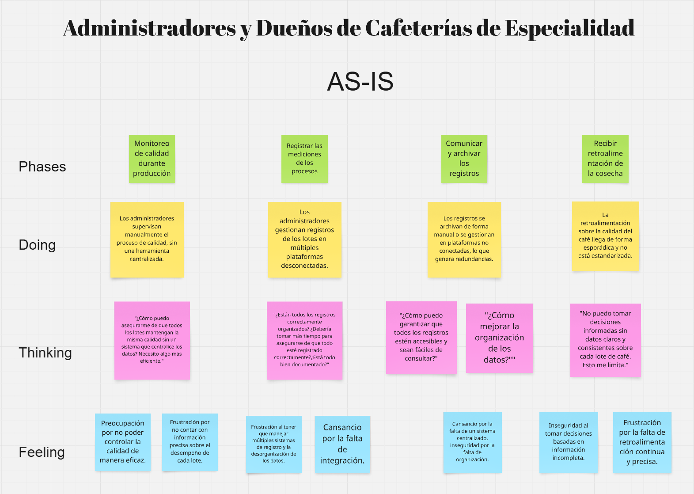</td>


**Barista Profesional**
<td>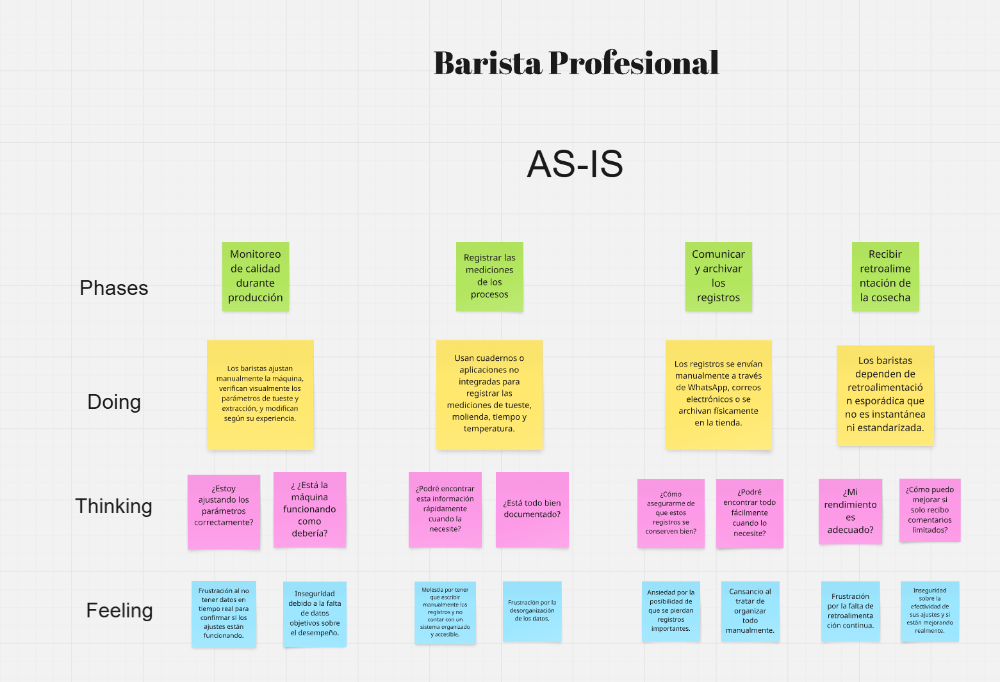</td>

## 2.4. Ubiquitous Language
En este proyecto, el uso de **Domain-Driven Design (DDD)** permite alinear el desarrollo de software con la realidad del negocio del café de especialidad. Uno de los pilares de DDD es el Lenguaje Ubicuo (Ubiquitous Language), el cual es un conjunto de términos compartidos que se construyen en colaboración entre desarrolladores, diseñadores y expertos del dominio, en nuestro caso, entre los desarrolladores, baristas y administradores de cafeterías.

**Glosario de Términos:**

<table border = 1>
  <thead>
    <tr>
      <th>Término (Inglés)</th>
      <th>Término (Español)</th>
      <th>Definición</th>
    </tr>
  </thead>
  <tbody>
    <tr>
      <td><strong>Coffee Lot</strong></td>
      <td>Lote de Café</td>
      <td>Conjunto de granos de café que comparten origen, variedad, proceso y cosecha.</td>
    </tr>
    <tr>
      <td><strong>Storage Conditions</strong></td>
      <td>Condiciones de Almacenamiento</td>
      <td>Parámetros ambientales (temperatura y humedad relativa) que afectan la calidad del grano de café verde y que deben mantenerse dentro de rangos óptimos.</td>
    </tr>
    <tr>
      <td><strong>Roast Profile</strong></td>
      <td>Perfil de Tueste</td>
      <td>Conjunto de parámetros que describen cómo se ha tostado un lote de café.</td>
    </tr>
    <tr>
      <td><strong>Roast Curve</strong></td>
      <td>Curva de Tueste</td>
      <td>Gráfica que muestra la evolución de temperatura del grano y del ambiente durante el proceso de tueste.</td>
    </tr>
    <tr>
      <td><strong>Calibration</strong></td>
      <td>Calibración</td>
      <td>Ajuste de variables en la preparación para estandarizar resultados sensoriales de una bebida.</td>
    </tr>
    <tr>
      <td><strong>Traceability</strong></td>
      <td>Trazabilidad</td>
      <td>Capacidad de seguir el recorrido del café desde su origen hasta la taza, incluyendo certificaciones y condiciones.</td>
    </tr>
    <tr>
      <td><strong>Cupping</strong></td>
      <td>Cata</td>
      <td>Evaluación sensorial del café basada en atributos como acidez, cuerpo, aroma y sabor.</td>
    </tr>
    <tr>
      <td><strong>Sensory Hexagon</strong></td>
      <td>Hexágono Sensorial</td>
      <td>Visualización gráfica, en un hexágono de radar,  de los atributos sensoriales del café, útil para comparar cafés según su perfil en taza.</td>
    </tr>
    <tr>
      <td><strong>Recipe Portfolio</strong></td>
      <td>Portafolio de Recetas</td>
      <td>Colección digital de recetas vinculadas a métodos, bebidas, clientes o competencias.</td>
    </tr>
    <tr>
      <td><strong>Green Inventory</strong></td>
      <td>Inventario de Café Verde</td>
      <td>Registro y control del café sin tostar, incluyendo lotes, estado y trazabilidad.</td>
    </tr>
    <tr>
      <td><strong>Roasted Inventory</strong></td>
      <td>Inventario de Café Tostado</td>
      <td>Registro del café ya tostado disponible, asociado a sus respectivos perfiles y lotes.</td>
    </tr>
    <tr>
      <td><strong>Certification</strong></td>
      <td>Certificación</td>
      <td>Documentación que acredita prácticas éticas o sostenibles de cada lote, tales como orgánico, comercio justo, etc.</td>
    </tr>
    <tr>
      <td><strong>TrackSilo</strong></td>
      <td>TrackSilo</td>
      <td>Dispositivo IoT que monitorea temperatura y humedad de los sacos de café verde, y alerta sobre condiciones fuera del rango óptimo.</td>
    </tr>
    <tr>
      <td><strong>Yield Analysis</strong></td>
      <td>Análisis de Rendimiento</td>
      <td>Cálculo de pérdida de peso tras el tueste y análisis económico del proceso.</td>
    </tr>
  </tbody>
</table>


# Capítulo III: Requirements Specification

## 3.1. To-Be Scenario Mapping
En el caso del To-be Scenario Mapping, el equipo definió cómo se visualizaría el flujo de trabajo una vez que la solución CaféLab haya sido implementada en los dos segmentos objetivos. El propósito de este artefacto es analizar y mejorar los aspectos negativos identificados en el As-is Scenario, optimizando los procesos de monitoreo, registro y retroalimentación, y elevando la calidad del café, la eficiencia operativa y la capacidad para tomar decisiones informadas.

**Administradores y dueños de cafeterias de especialidad**
<td></td>

**Barista Profesional**
<td></td>


## 3.2. User Stories
  Las user stories son una forma de convertir el lenguaje informal de los usuarios del sistema en requerimientos de software que deben ser considerados durante el desarrollo de la plataforma. Una user story bien construida le permite al desarrollador comprender la funcionalidad requerida, su propósito y el valor que aporta al usuario final. Para el proyecto Café Lab, se presenta un conjunto de user y technical stories que guían el desarrollo de la aplicación web, incluyendo módulos funcionales, vistas especializadas y componentes técnicos orientados a la trazabilidad y estandarización del café de especialidad.

| Epic/User Story ID | Título | Descripción | Criterios de Aceptación | Relacionado con (Epic ID) |
|-------|--------|------------|----------------------|-------------|
| EP01 | Gestión de Usuarios y Seguridad | Como sistema, necesito tener un control de usuarios seguro y personalizado para proteger la información y ofrecer una experiencia adaptada al perfil | N/A | N/A |
| US01 | Registro y Autenticación (Usuarios) | Como barista profesional o dueño de cafetería de especialidad, quiero registrarme y acceder de forma segura para mantener la confidencialidad de mis datos | **Escenario 1:** El usuario accede a la pantalla de registro.<br>**Dado que** el usuario no tiene una cuenta en el sistema<br>**Cuando** visualiza las opciones de registro (correo, Google, Facebook)<br>**Entonces** el sistema permite elegir su método preferido y completar el registro.<br><br>**Escenario 2:** El usuario inicia sesión.<br>**Dado que** el usuario ya tiene una cuenta registrada<br>**Cuando** ingresa sus credenciales correctamente<br>**Entonces** el sistema le permite acceder a su panel personalizado.<br><br>**Escenario 3:** El usuario ingresa credenciales incorrectas.<br>**Dado que** el usuario tiene una cuenta<br>**Cuando** ingresa datos erróneos<br>**Entonces** el sistema muestra un mensaje de error y opciones de recuperación. | EP01 |
| US02 | Perfil Personalizado | Como barista profesional o dueño de cafetería de especialidad, quiero configurar mi perfil profesional para personalizar mi experiencia y mostrar mi identidad dentro del sistema | **Escenario 1:** Configuración inicial de perfil.<br>**Dado que** el usuario ha completado el registro exitosamente<br>**Cuando** accede por primera vez al sistema<br>**Entonces** el sistema solicita completar información básica (nombre, rol, experiencia).<br><br>**Escenario 2:** Actualización de perfil.<br>**Dado que** el usuario desea modificar sus datos personales<br>**Cuando** accede a la sección de perfil y realiza cambios<br>**Entonces** el sistema guarda la información actualizada correctamente. | EP01 |
| US03 | Selección de Plan | Como barista profesional o dueño de cafetería de especialidad, quiero elegir entre los diferentes planes disponibles para acceder a las funcionalidades que mejor se adapten a mis necesidades | **Escenario 1:** Visualización de planes.<br>**Dado que** el usuario está registrado en el sistema<br>**Cuando** accede a la sección de planes disponibles<br>**Entonces** el sistema muestra una comparativa detallada de funcionalidades y precios.<br><br>**Escenario 2:** Selección de plan gratuito.<br>**Dado que** el usuario desea utilizar funcionalidades básicas<br>**Cuando** selecciona "Plan Base Cafetal"<br>**Entonces** el sistema le otorga acceso inmediato a las funcionalidades correspondientes. | EP01 |
| EP02 | Gestión de Materia Prima | Como sistema, necesito ofrecer herramientas para el control, seguimiento y documentación del café verde para garantizar trazabilidad y calidad desde el origen | N/A | N/A |
| US04 | Registro de Proveedores | Como dueño de cafetería de especialidad, quiero registrar y evaluar a mis proveedores para mantener un control de calidad y trazabilidad de origen | **Escenario 1:** Creación de nuevo proveedor.<br>**Dado que** se establece relación con un nuevo proveedor de café<br>**Cuando** el usuario ingresa los datos completos (nombre, ubicación, contacto, tipos de café)<br>**Entonces** el sistema registra la información y genera un perfil de proveedor.<br><br>**Escenario 2:** Evaluación de proveedor.<br>**Dado que** se han recibido lotes de un proveedor específico<br>**Cuando** el usuario completa el formulario de evaluación con criterios definidos<br>**Entonces** el sistema guarda la evaluación en el historial del proveedor. | EP02 |
| US05 | Gestión de Lotes de Café Verde | Como barista profesional o dueño de cafetería de especialidad, quiero registrar y hacer seguimiento de cada lote de café verde para mantener control de inventario y trazabilidad | **Escenario 1:** Ingreso de nuevo lote.<br>**Dado que** se recibe un nuevo lote de café verde<br>**Cuando** el usuario registra sus características completas (origen, variedad, proceso, altitud, peso)<br>**Entonces** el sistema genera un código único de trazabilidad para ese lote.<br><br>**Escenario 2:** Actualización de estado.<br>**Dado que** un lote cambia de condición durante su ciclo de vida<br>**Cuando** el usuario actualiza su estado (almacenado, en tueste, agotado)<br>**Entonces** el sistema registra la fecha, hora y responsable del cambio de estado. | EP02 |
| US06 | Registro de Certificaciones | Como dueño de cafetería de especialidad, quiero documentar las certificaciones de mis cafés para validar y comunicar su valor agregado | **Escenario 1:** Registro de certificación.<br>**Dado que** un lote cuenta con certificaciones oficiales (orgánico, comercio justo)<br>**Cuando** el usuario adjunta la documentación correspondiente al perfil del lote<br>**Entonces** el sistema valida y vincula la certificación, haciéndola verificable.<br><br>**Escenario 2:** Generación de etiquetas.<br>**Dado que** el usuario necesita comunicar certificaciones a clientes<br>**Cuando** selecciona un lote certificado y solicita generar etiquetas<br>**Entonces** el sistema produce etiquetas digitales con los sellos correspondientes. | EP02 |
| EP03 | Gestión de Procesos de Tueste | Como sistema, necesito facilitar el registro, análisis y optimización de los procesos de tueste para garantizar resultados consistentes y de alta calidad | N/A | N/A |
| US07 | Creación de Perfil de Tueste | Como barista profesional, quiero crear perfiles de tueste personalizados para documentar y replicar mis mejores resultados | **Escenario 1:** Creación manual de perfil.<br>**Dado que** el usuario desarrolla un nuevo perfil de tueste<br>**Cuando** ingresa todos los parámetros requeridos (temperatura inicial, curva, tiempo, desarrollo)<br>**Entonces** el sistema guarda el perfil en su biblioteca personal.<br><br>**Escenario 2:** Duplicación y modificación.<br>**Dado que** el usuario quiere adaptar un perfil existente<br>**Cuando** selecciona la opción "duplicar" y modifica valores específicos<br>**Entonces** el sistema crea una nueva variante manteniendo referencia al perfil original. | EP03 |
| US08 | Registro de Sesión de Tueste | Como barista profesional, quiero documentar cada sesión de tueste asociada a un lote específico para mantener trazabilidad y control de calidad | **Escenario 1:** Inicio de sesión de tueste.<br>**Dado que** el usuario comienza el proceso de tostar un lote específico<br>**Cuando** selecciona el lote de origen y el perfil de tueste a utilizar<br>**Entonces** el sistema inicia el registro de la sesión con timestamp.<br><br>**Escenario 2:** Registro manual de puntos.<br>**Dado que** el usuario observa cambios durante el proceso de tueste<br>**Cuando** ingresa lecturas de temperatura y tiempo en puntos significativos<br>**Entonces** el sistema construye la curva real de tueste basada en estos datos. | EP03 |
| US09 | Análisis Comparativo de Tuestes | Como barista profesional, quiero comparar diferentes sesiones de tueste para identificar patrones y optimizar resultados | **Escenario 1:** Selección de sesiones a comparar.<br>**Dado que** el usuario tiene múltiples sesiones de tueste registradas<br>**Cuando** selecciona dos o más sesiones para análisis comparativo<br>**Entonces** el sistema muestra las curvas superpuestas con códigos de color diferenciados.<br><br>**Escenario 2:** Análisis de variables específicas.<br>**Dado que** el usuario desea estudiar factores concretos del tueste<br>**Cuando** selecciona variables específicas de interés (tiempo desarrollo, temperatura final)<br>**Entonces** el sistema muestra su correlación con los resultados sensoriales registrados. | EP03 |
| US10 | Biblioteca de Defectos de Tueste | Como barista profesional, quiero acceder a una biblioteca de defectos comunes para identificar y corregir problemas en mis tuestes | **Escenario 1:** Consulta de defecto.<br>**Dado que** el usuario observa anomalías en su café recién tostado<br>**Cuando** busca en el sistema por características visuales o descriptivas del problema<br>**Entonces** el sistema muestra posibles defectos coincidentes con sus causas y soluciones.<br><br>**Escenario 2:** Documentación de soluciones.<br>**Dado que** el usuario identifica un defecto específico en su tueste<br>**Cuando** accede a la ficha detallada del defecto en la biblioteca<br>**Entonces** el sistema presenta causas probables y soluciones recomendadas con ejemplos. | EP03 |
| EP04 | Evaluación Sensorial del Café | Como sistema, necesito proveer herramientas para la evaluación, registro y análisis sensorial del café para vincular aspectos técnicos con la experiencia final en taza | N/A | N/A |
| US11 | Cata Digital Estructurada | Como barista profesional, quiero registrar evaluaciones sensoriales estructuradas para documentar las características de cada lote y tueste | **Escenario 1:** Creación de nueva cata.<br>**Dado que** el usuario prueba un café recién tostado<br>**Cuando** inicia una nueva sesión de cata vinculada al lote y tueste específicos<br>**Entonces** el sistema presenta el formulario completo de evaluación sensorial.<br><br>**Escenario 2:** Evaluación por atributos.<br>**Dado que** el usuario sigue un protocolo estandarizado de cata<br>**Cuando** califica cada atributo sensorial (acidez, cuerpo, dulzor, etc.) en la escala definida<br>**Entonces** el sistema genera automáticamente el perfil sensorial completo. | EP04 |
| US12 | Visualización de Perfiles Sensoriales | Como barista profesional o dueño de cafetería de especialidad, quiero visualizar perfiles sensoriales en formato de hexágono o gráfico de radar para interpretar y comparar cualidades | **Escenario 1:** Generación de hexágono sensorial.<br>**Dado que** el usuario ha completado una evaluación de cata<br>**Cuando** solicita la visualización gráfica de los resultados<br>**Entonces** el sistema genera el hexágono con los seis atributos principales evaluados.<br><br>**Escenario 2:** Comparación de perfiles.<br>**Dado que** el usuario desea contrastar diferentes cafés evaluados<br>**Cuando** selecciona múltiples catas para visualización simultánea<br>**Entonces** el sistema muestra los hexágonos superpuestos con códigos de color diferenciados. | EP04 |
| US13 | Correlación Tueste-Sabor | Como barista profesional, quiero visualizar la correlación entre parámetros de tueste y resultados sensoriales para optimizar mis perfiles | **Escenario 1:** Análisis de factor específico.<br>**Dado que** el usuario busca entender la influencia de un parámetro técnico<br>**Cuando** selecciona una variable concreta de tueste (ej. tiempo de desarrollo)<br>**Entonces** el sistema muestra gráficos de correlación con atributos sensoriales registrados.<br><br>**Escenario 2:** Identificación de patrones.<br>**Dado que** el usuario busca consistencia en resultados sensoriales<br>**Cuando** analiza múltiples sesiones que produjeron perfiles similares<br>**Entonces** el sistema identifica y destaca patrones comunes en los perfiles de tueste. | EP04 |
| US14 | Historial de Catas | Como barista profesional, quiero acceder al historial de catas por lote, origen o periodo para analizar tendencias y consistencia | **Escenario 1:** Filtrado por criterios múltiples.<br>**Dado que** el usuario busca catas específicas en su historial<br>**Cuando** aplica filtros combinados (fecha, origen, variedad, procesamiento)<br>**Entonces** el sistema muestra resultados que cumplen todos los criterios establecidos.<br><br>**Escenario 2:** Análisis de evolución temporal.<br>**Dado que** el usuario quiere evaluar cambios en el tiempo de un mismo café<br>**Cuando** selecciona un lote específico con múltiples catas realizadas<br>**Entonces** el sistema presenta gráficos de evolución de atributos a lo largo del tiempo. | EP04 |
| EP05 | Gestión de Preparación y Recetas | Como sistema, necesito ofrecer herramientas para la gestión, estandarización y compartición de recetas y métodos de preparación para garantizar consistencia en la experiencia final | N/A | N/A |
| US15 | Creación de Recetas de Preparación | Como barista profesional, quiero crear y documentar recetas detalladas para cada método de preparación y tipo de café | **Escenario 1:** Creación de receta estándar.<br>**Dado que** el usuario desarrolla una nueva receta de preparación<br>**Cuando** registra todos los parámetros requeridos (ratio, temperatura, tiempo, molienda, método)<br>**Entonces** el sistema guarda la receta completa en su biblioteca personal.<br><br>**Escenario 2:** Vinculación a lote específico.<br>**Dado que** el usuario optimiza una receta para un café particular<br>**Cuando** asocia la receta a un lote específico registrado en el sistema<br>**Entonces** el sistema establece la trazabilidad completa desde origen hasta método de preparación. | EP05 |
| US16 | Calibración de Molienda | Como barista profesional, quiero documentar configuraciones de molienda para diferentes equipos y métodos para mantener consistencia entre preparaciones | **Escenario 1:** Registro de nueva calibración.<br>**Dado que** el usuario ajusta un molino para un método específico<br>**Cuando** documenta la configuración precisa (número, apertura) en el sistema<br>**Entonces** la calibración queda registrada con fecha, equipo y método asociados.<br><br>**Escenario 2:** Referencia visual comparativa.<br>**Dado que** el usuario necesita una referencia objetiva de molienda<br>**Cuando** adjunta foto de la molienda y registra el tiempo resultante de extracción<br>**Entonces** el sistema almacena estos datos como estándar visual para comparaciones futuras. | EP05 |
| US17 | Portafolio de Bebidas | Como barista profesional o dueño de cafetería de especialidad, quiero crear un portafolio digital de bebidas y recetas para presentar a clientes o eventos | **Escenario 1:** Creación de ficha de bebida.<br>**Dado que** el usuario desarrolla una bebida especial para su menú<br>**Cuando** completa la ficha técnica (ingredientes, método, presentación, foto)<br>**Entonces** el sistema incorpora la bebida a su portafolio digital profesional.<br><br>**Escenario 2:** Organización por categorías personalizadas.<br>**Dado que** el usuario maneja diversas bebidas en su portafolio<br>**Cuando** las clasifica según tipos definidos (espresso, filtrado, signature, estacionales)<br>**Entonces** el sistema genera un catálogo organizado y fácilmente consultable. | EP05 |
| US18 | Compartir Recetas | Como barista profesional, quiero compartir mis recetas con mi equipo para mantener consistencia en la preparación | **Escenario 1:** Compartir con equipo interno.<br>**Dado que** el usuario desarrolla una receta exitosa que debe estandarizarse<br>**Cuando** la marca como "compartida con equipo" y define permisos<br>**Entonces** el sistema la pone a disposición de todos los miembros autorizados.<br><br>**Escenario 2:** Sugerencia de mejoras.<br>**Dado que** un miembro del equipo prueba una receta compartida<br>**Cuando** implementa variaciones y propone ajustes documentados<br>**Entonces** el sistema notifica al creador original y registra las sugerencias manteniendo la versión original. | EP05 |
| EP06 | Administración y Reportes | Como sistema, necesito proporcionar herramientas de gestión, análisis y reportes que conecten los aspectos técnicos con los operativos y financieros para optimizar la operación integral | N/A | N/A |
| US19 | Control de Inventario Integrado | Como dueño de cafetería de especialidad, quiero gestionar el inventario de café verde y tostado de forma integrada para optimizar recursos y prevenir desabastecimiento | **Escenario 1:** Seguimiento centralizado de stock.<br>**Dado que** el usuario maneja múltiples productos y estados del café<br>**Cuando** accede al panel central de inventario<br>**Entonces** el sistema muestra niveles actuales, movimientos recientes y alertas activas.<br><br>**Escenario 2:** Registro de consumo con trazabilidad.<br>**Dado que** el usuario utiliza café para producción diaria<br>**Cuando** registra el consumo vinculándolo a lotes específicos y productos finales<br>**Entonces** el sistema actualiza automáticamente las existencias y mantiene la trazabilidad. | EP06 |
| US20 | Gestión de Costos de Producción | Como dueño de cafetería de especialidad, quiero registrar y analizar los costos de producción de cada lote para optimizar mi estructura de precios y rentabilidad | **Escenario 1:** Registro completo de estructura de costos.<br>**Dado que** el usuario necesita documentar todos los costos de un lote<br>**Cuando** ingresa al módulo de costos y selecciona un lote procesado<br>**Entonces** el sistema presenta un formulario con categorías predefinidas para cada tipo de costo (compra, transporte, almacenamiento, mano de obra, procesamiento).<br><br>**Escenario 2:** Visualización de indicadores económicos.<br>**Dado que** el usuario ha completado el registro de costos<br>**Cuando** accede al dashboard económico del lote<br>**Entonces** el sistema muestra automáticamente indicadores clave como costo por kilo, costo por taza y margen potencial según precios de mercado. | EP06 |
| US21 | Análisis de Eficiencia y Rendimiento | Como dueño de cafetería de especialidad, quiero monitorear y comparar el rendimiento productivo entre distintos lotes para identificar factores que afectan la eficiencia | **Escenario 1:** Registro automático de indicadores de rendimiento.<br>**Dado que** un lote ha sido procesado completamente<br>**Cuando** el usuario finaliza el registro de tueste y producción<br>**Entonces** el sistema calcula automáticamente métricas de rendimiento (% de merma, tiempo efectivo, productividad por hora).<br><br>**Escenario 2:** Comparativa avanzada entre lotes.<br>**Dado que** el usuario busca optimizar su producción<br>**Cuando** accede a la herramienta de análisis y selecciona múltiples lotes con atributos similares<br>**Entonces** el sistema genera una tabla comparativa que resalta variaciones significativas en rendimiento y señala posibles causas basadas en parámetros registrados. | EP06 |
| US22 | Reportes de Trazabilidad | Como dueño de cafetería de especialidad, quiero generar reportes de trazabilidad completa para comunicar transparencia y valor agregado | **Escenario 1:** Generación de reporte integral por lote.<br>**Dado que** el usuario necesita documentar la trazabilidad completa<br>**Cuando** selecciona un lote específico que ha sido procesado<br>**Entonces** el sistema genera un informe detallado con toda la cadena documentada desde origen.<br><br>**Escenario 2:** Ficha técnica comercial para cliente.<br>**Dado que** el usuario necesita comunicar el valor diferencial de su producto<br>**Cuando** solicita generar una ficha para un producto específico de su catálogo<br>**Entonces** el sistema produce un documento que incluye origen, procesamiento, tueste y perfil sensorial. | EP06 |
| EP07 | Landing Page y Sitio Web Estático | Como sistema, necesito proporcionar un sitio web informativo y atractivo que comunique el valor de la plataforma a diferentes segmentos objetivo | N/A | N/A |
| US23 | Información del Producto | Como visitante de la landing page, quiero encontrar información clara sobre la plataforma para entender sus beneficios y decidir si me interesa | **Escenario 1:** Primera visita al sitio.<br>**Dado que** el visitante accede por primera vez al sitio web<br>**Cuando** carga la página de inicio<br>**Entonces** visualiza el mensaje principal (value proposition) y beneficios clave.<br><br>**Escenario 2:** Exploración de características.<br>**Dado que** el visitante desea conocer las funcionalidades<br>**Cuando** navega por la sección de características destacadas<br>**Entonces** encuentra información clara con ilustraciones visuales de cada funcionalidad. | EP07 |
| US24 | Secciones Específicas por Segmento | Como visitante de la landing page, quiero encontrar información adaptada a mi perfil profesional para evaluar si la solución responde a mis necesidades específicas | **Escenario 1:** Sección para baristas.<br>**Dado que** el visitante se identifica como barista profesional<br>**Cuando** accede a la sección "Para Baristas"<br>**Entonces** encuentra contenido adaptado a sus desafíos específicos y testimonios relevantes.<br><br>**Escenario 2:** Sección para cafeterías.<br>**Dado que** el visitante administra o es dueño de una cafetería<br>**Cuando** accede a la sección "Para Cafeterías"<br>**Entonces** encuentra contenido enfocado en gestión de negocios, trazabilidad y certificaciones. | EP07 |
| US25 | Contacto con Equipo | Como visitante de la landing page, quiero contactar con el equipo del sistema para resolver dudas específicas antes de registrarme | **Escenario 1:** Envío de consulta.<br>**Dado que** el visitante tiene preguntas sobre la plataforma<br>**Cuando** completa el formulario de contacto con sus datos y consulta<br>**Entonces** el sistema envía la información al equipo y muestra confirmación.<br><br>**Escenario 2:** Solicitud de demostración.<br>**Dado que** el visitante quiere ver el sistema en funcionamiento<br>**Cuando** solicita una demostración personalizada mediante el formulario específico<br>**Entonces** el sistema agenda la cita y envía confirmación con los detalles de conexión. | EP07 |
| US26 | Acceso directo a plataforma | Como visitante de la landing page, quiero redirigirme hacia la aplicación principal desde la landing page para comenzar a usar el sistema inmediatamente | **Escenario 1:** Navegación exitosa<br>**Dado que** el visitante quiere empezar a usar el sistema<br>**Cuando** navegue por la landing page y pulse el botón de acceso a la plataforma<br>**Entonces** será transferido correctamente a la interfaz principal del sistema.<br><br>**Escenario 2:** Error de conexión<br>**Dado que** el visitante intenta ingresar al sistema<br>**Cuando** pulse el botón de acceso en la landing page y exista un problema de conexión o disponibilidad del servidor<br>**Entonces** visualizará una notificación clara explicando el problema. | EP07 |
| TS01 | POST HTTPS Usuarios | Como desarrollador, quiero registrar nuevos usuarios mediante una API para permitir el acceso al sistema | **Escenario 1:**<br>**Dado que** tengo acceso a la API de registro de usuarios<br>**Cuando** solicito registrar un usuario con datos válidos<br>**Entonces** recibo confirmación de usuario creado con su identificador.<br><br>**Escenario 2:**<br>**Dado que** tengo acceso a la API de registro de usuarios<br>**Cuando** solicito registrar un usuario con email ya existente<br>**Entonces** recibo un mensaje indicando que el email ya está registrado. | N/A |
| TS02 | POST HTTPS Autenticación | Como desarrollador, quiero autenticar usuarios mediante una API para validar credenciales y permitir acceso seguro | **Escenario 1:**<br>**Dado que** tengo acceso a la API de autenticación<br>**Cuando** envío credenciales válidas de un usuario<br>**Entonces** recibo confirmación de acceso autorizado.<br><br>**Escenario 2:**<br>**Dado que** tengo acceso a la API de autenticación<br>**Cuando** envío credenciales incorrectas<br>**Entonces** recibo un mensaje indicando error de autenticación. | N/A |
| TS03 | GET HTTPS Planes | Como desarrollador, quiero obtener información sobre planes disponibles mediante una API para mostrar opciones de suscripción | **Escenario 1:**<br>**Dado que** tengo acceso a la API de planes<br>**Cuando** solicito la lista de planes disponibles<br>**Entonces** recibo todos los planes con sus características y precios.<br><br>**Escenario 2:**<br>**Dado que** tengo acceso a la API de planes<br>**Cuando** solicito los planes y hay un problema técnico<br>**Entonces** recibo un mensaje indicando que el servicio no está disponible. | N/A |
| TS04 | POST HTTPS Planes | Como desarrollador, quiero suscribir usuarios a planes mediante una API para gestionar acceso a funcionalidades | **Escenario 1:**<br>**Dado que** tengo acceso a la API de suscripciones<br>**Cuando** solicito una suscripción con plan y pago válidos<br>**Entonces** recibo confirmación de la suscripción activada.<br><br>**Escenario 2:**<br>**Dado que** tengo acceso a la API de suscripciones<br>**Cuando** solicito una suscripción con método de pago rechazado<br>**Entonces** recibo un mensaje sobre el problema de pago. | N/A |
| TS05 | POST HTTPS Proveedores | Como desarrollador, quiero registrar nuevos proveedores mediante una API para ampliar la red de suministro | **Escenario 1:**<br>**Dado que** tengo acceso a la API de proveedores<br>**Cuando** solicito registrar un proveedor con datos completos<br>**Entonces** recibo confirmación del proveedor creado con su identificador.<br><br>**Escenario 2:**<br>**Dado que** tengo acceso a la API de proveedores<br>**Cuando** solicito registrar un proveedor con datos incompletos<br>**Entonces** recibo un mensaje con los campos requeridos faltantes. | N/A |
| TS06 | GET HTTPS Proveedores | Como desarrollador, quiero consultar proveedores mediante una API para mostrar opciones disponibles | **Escenario 1:**<br>**Dado que** tengo acceso a la API de proveedores<br>**Cuando** solicito la lista de proveedores con filtros<br>**Entonces** recibo los proveedores que cumplen los criterios.<br><br>**Escenario 2:**<br>**Dado que** tengo acceso a la API de proveedores<br>**Cuando** solicito proveedores con parámetros incorrectos<br>**Entonces** recibo un mensaje indicando los parámetros inválidos. | N/A |
| TS07 | POST HTTPS Lotes | Como desarrollador, quiero registrar nuevos lotes de café mediante una API para mantener el inventario actualizado | **Escenario 1:**<br>**Dado que** tengo acceso a la API de lotes<br>**Cuando** solicito registrar un lote con datos completos<br>**Entonces** recibo confirmación del lote creado con su código de trazabilidad.<br><br>**Escenario 2:**<br>**Dado que** tengo acceso a la API de lotes<br>**Cuando** solicito registrar un lote con un proveedor inexistente<br>**Entonces** recibo un mensaje indicando que el proveedor no existe. | N/A |
| TS08 | PATCH HTTPS Lotes | Como desarrollador, quiero actualizar el estado de lotes mediante una API para reflejar cambios en el ciclo de vida | **Escenario 1:**<br>**Dado que** tengo acceso a la API de lotes<br>**Cuando** solicito cambiar el estado de un lote a un valor válido<br>**Entonces** recibo el lote con su estado actualizado.<br><br>**Escenario 2:**<br>**Dado que** tengo acceso a la API de lotes<br>**Cuando** solicito un cambio de estado no permitido<br>**Entonces** recibo un mensaje con los cambios de estado permitidos. | N/A |
| TS09 | POST HTTPS Certificaciones | Como desarrollador, quiero registrar certificaciones mediante una API para validar la calidad y origen del café | **Escenario 1:**<br>**Dado que** tengo acceso a la API de certificaciones<br>**Cuando** solicito registrar una certificación válida para un lote<br>**Entonces** recibo confirmación de la certificación registrada.<br><br>**Escenario 2:**<br>**Dado que** tengo acceso a la API de certificaciones<br>**Cuando** solicito registrar un tipo de certificación no soportado<br>**Entonces** recibo un mensaje con los tipos de certificación válidos. | N/A |
| TS10 | GET HTTPS Certificaciones | Como desarrollador, quiero obtener certificaciones mediante una API para mostrar valor agregado del producto | **Escenario 1:**<br>**Dado que** tengo acceso a la API de certificaciones<br>**Cuando** solicito las certificaciones de un lote existente<br>**Entonces** recibo todas las certificaciones asociadas al lote.<br><br>**Escenario 2:**<br>**Dado que** tengo acceso a la API de certificaciones<br>**Cuando** solicito certificaciones de un lote que no existe<br>**Entonces** recibo un mensaje indicando que el lote no existe. | N/A |
| TS11 | POST HTTPS Perfiles-Tueste | Como desarrollador, quiero crear perfiles de tueste mediante una API para estandarizar procesos | **Escenario 1:**<br>**Dado que** tengo acceso a la API de perfiles de tueste<br>**Cuando** solicito crear un perfil con parámetros completos<br>**Entonces** recibo confirmación del perfil creado en la biblioteca.<br><br>**Escenario 2:**<br>**Dado que** tengo acceso a la API de perfiles de tueste<br>**Cuando** solicito crear un perfil con temperaturas fuera de rango<br>**Entonces** recibo un mensaje con los rangos permitidos. | N/A |
| TS12 | POST HTTPS Sesiones-Tueste | Como desarrollador, quiero registrar sesiones de tueste mediante una API para documentar cada proceso | **Escenario 1:**<br>**Dado que** tengo acceso a la API de sesiones de tueste<br>**Cuando** solicito iniciar una sesión con lote y perfil válidos<br>**Entonces** recibo confirmación de la sesión iniciada.<br><br>**Escenario 2:**<br>**Dado que** tengo acceso a la API de sesiones de tueste<br>**Cuando** solicito iniciar sesión con un lote ya agotado<br>**Entonces** recibo un mensaje indicando que el lote no está disponible. | N/A |
| TS13 | PATCH HTTPS Sesiones-Tueste | Como desarrollador, quiero actualizar lecturas de una sesión de tueste mediante una API para construir la curva real | **Escenario 1:**<br>**Dado que** tengo acceso a la API de sesiones de tueste<br>**Cuando** envío nuevas lecturas de tiempo y temperatura<br>**Entonces** recibo confirmación de la lectura registrada.<br><br>**Escenario 2:**<br>**Dado que** tengo acceso a la API de sesiones de tueste<br>**Cuando** envío lecturas a una sesión ya finalizada<br>**Entonces** recibo un mensaje indicando que la sesión está cerrada. | N/A |
| TS14 | GET HTTPS Análisis-Tueste | Como desarrollador, quiero obtener análisis comparativo de tuestes mediante una API para identificar patrones | **Escenario 1:**<br>**Dado que** tengo acceso a la API de análisis<br>**Cuando** solicito comparar varias sesiones de tueste<br>**Entonces** recibo las curvas comparativas y correlaciones.<br><br>**Escenario 2:**<br>**Dado que** tengo acceso a la API de análisis<br>**Cuando** solicito comparar demasiadas sesiones<br>**Entonces** recibo un mensaje indicando el límite máximo permitido. | N/A |
| TS15 | GET HTTPS Defectos-Tueste | Como desarrollador, quiero consultar defectos comunes en tueste mediante una API para asistir en diagnóstico de problemas | **Escenario 1:**<br>**Dado que** tengo acceso a la API de defectos<br>**Cuando** busco defectos con criterios específicos<br>**Entonces** recibo los defectos coincidentes y sus soluciones.<br><br>**Escenario 2:**<br>**Dado que** tengo acceso a la API de defectos<br>**Cuando** busco sin especificar ningún criterio<br>**Entonces** recibo un mensaje solicitando al menos un parámetro de búsqueda. | N/A |
| TS16 | POST HTTPS Catas | Como desarrollador, quiero registrar evaluaciones sensoriales mediante una API para documentar características del café | **Escenario 1:**<br>**Dado que** tengo acceso a la API de catas<br>**Cuando** envío una evaluación completa de un café<br>**Entonces** recibo confirmación de la cata registrada.<br><br>**Escenario 2:**<br>**Dado que** tengo acceso a la API de catas<br>**Cuando** envío una cata sin identificar el lote o tueste<br>**Entonces** recibo un mensaje indicando que se requiere identificar el café. | N/A |
| TS17 | GET HTTPS Perfiles-Sensoriales | Como desarrollador, quiero obtener perfiles sensoriales mediante una API para visualizar y comparar cualidades | **Escenario 1:**<br>**Dado que** tengo acceso a la API de perfiles sensoriales<br>**Cuando** solicito un perfil sensorial existente<br>**Entonces** recibo los datos para generar el hexágono sensorial.<br><br>**Escenario 2:**<br>**Dado que** tengo acceso a la API de perfiles sensoriales<br>**Cuando** solicito un perfil que no existe<br>**Entonces** recibo un mensaje indicando que el perfil no se encontró. | N/A |
| TS18 | GET HTTPS Correlaciones | Como desarrollador, quiero obtener correlaciones entre tueste y sabor mediante una API para optimizar procesos | **Escenario 1:**<br>**Dado que** tengo acceso a la API de análisis<br>**Cuando** solicito correlaciones entre parámetros específicos<br>**Entonces** recibo los datos de correlación estadística.<br><br>**Escenario 2:**<br>**Dado que** tengo acceso a la API de análisis<br>**Cuando** solicito correlacionar parámetros incompatibles<br>**Entonces** recibo un mensaje con los parámetros que pueden correlacionarse. | N/A |
| TS19 | POST HTTPS Recetas | Como desarrollador, quiero registrar recetas de preparación mediante una API para documentar métodos óptimos | **Escenario 1:**<br>**Dado que** tengo acceso a la API de recetas<br>**Cuando** envío una receta completa de preparación<br>**Entonces** recibo confirmación de la receta guardada.<br><br>**Escenario 2:**<br>**Dado que** tengo acceso a la API de recetas<br>**Cuando** envío una receta con método de preparación inválido<br>**Entonces** recibo un mensaje con los métodos válidos. | N/A |
| TS20 | POST HTTPS Calibraciones | Como desarrollador, quiero registrar calibraciones de molienda mediante una API para mantener consistencia entre preparaciones | **Escenario 1:**<br>**Dado que** tengo acceso a la API de calibraciones<br>**Cuando** envío una nueva calibración con todos los datos<br>**Entonces** recibo confirmación de la calibración registrada.<br><br>**Escenario 2:**<br>**Dado que** tengo acceso a la API de calibraciones<br>**Cuando** envío una imagen en formato no soportado<br>**Entonces** recibo un mensaje con los formatos de imagen permitidos. | N/A |
| TS21 | GET HTTPS Inventario | Como desarrollador, quiero consultar el inventario integrado mediante una API para visualizar existencias | **Escenario 1:**<br>**Dado que** tengo acceso a la API de inventario<br>**Cuando** solicito el inventario con filtros específicos<br>**Entonces** recibo el listado de existencias actualizado.<br><br>**Escenario 2:**<br>**Dado que** tengo acceso a la API de inventario<br>**Cuando** solicito información sin tener permisos suficientes<br>**Entonces** recibo un mensaje indicando acceso denegado. | N/A |
| TS22 | PATCH HTTPS Inventario | Como desarrollador, quiero actualizar el consumo de inventario mediante una API para mantener existencias actualizadas | **Escenario 1:**<br>**Dado que** tengo acceso a la API de inventario<br>**Cuando** registro el consumo de un producto con cantidad válida<br>**Entonces** recibo confirmación del inventario actualizado.<br><br>**Escenario 2:**<br>**Dado que** tengo acceso a la API de inventario<br>**Cuando** registro un consumo mayor al disponible<br>**Entonces** recibo un mensaje indicando stock insuficiente. | N/A |
| TS23 | POST HTTPS Contacto | Como desarrollador, quiero procesar formularios de contacto mediante una API para gestionar comunicaciones con visitantes | **Escenario 1:**<br>**Dado que** tengo acceso a la API pública<br>**Cuando** envío un formulario de contacto completo<br>**Entonces** recibo confirmación del mensaje enviado.<br><br>**Escenario 2:**<br>**Dado que** tengo acceso a la API pública<br>**Cuando** envío un formulario sin email de contacto<br>**Entonces** recibo un mensaje indicando que el email es obligatorio. | N/A | para comparar<br>**Entonces** recibo código 400 indicando el límite máximo de sesiones comparables.


## 3.3. Impact Mapping


## 3.4. Product Backlog
<table>
        <tr>
            <th># Orden</th>
            <th>User Story Id</th>
            <th>Título</th>
            <th>Descripción</th>
            <th>Story Points<br>(1/2/3/5/8)</th>
        </tr>
        <tr>
            <td class="center">1</td>
            <td>US22</td>
            <td>Información del Producto</td>
            <td>Como visitante de la landing page, quiero encontrar información clara sobre la plataforma para entender sus beneficios y decidir si me interesa</td>
            <td class="center">1</td>
        </tr>
        <tr>
            <td class="center">2</td>
            <td>US23</td>
            <td>Secciones Específicas por Segmento</td>
            <td>Como visitante de la landing page, quiero encontrar información adaptada a mi perfil profesional para evaluar si la solución responde a mis necesidades específicas</td>
            <td class="center">2</td>
        </tr>
        <tr>
            <td class="center">3</td>
            <td>US24</td>
            <td>Contacto con Equipo</td>
            <td>Como visitante de la landing page, quiero contactar con el equipo del sistema para resolver dudas específicas antes de registrarme</td>
            <td class="center">3</td>
        </tr>
        <tr>
            <td class="center">4</td>
            <td>US25</td>
            <td>Acceso directo a plataforma</td>
            <td>Como visitante de la landing page, quiero redirigirme hacia la aplicación principal desde la landing page para comenzar a usar el sistema inmediatamente</td>
            <td class="center">2</td>
        </tr>
        <tr>
            <td class="center">5</td>
            <td>US05</td>
            <td>Gestión de Lotes de Café Verde</td>
            <td>Como barista profesional o dueño de cafetería de especialidad, quiero registrar y hacer seguimiento de cada lote de café verde para mantener control de inventario y trazabilidad</td>
            <td class="center">5</td>
        </tr>
        <tr>
            <td class="center">6</td>
            <td>US15</td>
            <td>Creación de Recetas de Preparación</td>
            <td>Como barista profesional, quiero crear y documentar recetas detalladas para cada método de preparación y tipo de café</td>
            <td class="center">5</td>
        </tr>
        <tr>
            <td class="center">7</td>
            <td>US11</td>
            <td>Cata Digital Estructurada</td>
            <td>Como barista profesional, quiero registrar evaluaciones sensoriales estructuradas para documentar las características de cada lote y tueste</td>
            <td class="center">3</td>
        </tr>
        <tr>
            <td class="center">8</td>
            <td>US19</td>
            <td>Control de Inventario Integrado</td>
            <td>Como dueño de cafetería de especialidad, quiero gestionar el inventario de café verde y tostado de forma integrada para optimizar recursos y prevenir desabastecimiento</td>
            <td class="center">3</td>
        </tr>
        <tr>
            <td class="center">9</td>
            <td>US07</td>
            <td>Creación de Perfil de Tueste</td>
            <td>Como barista profesional, quiero crear perfiles de tueste personalizados para documentar y replicar mis mejores resultados</td>
            <td class="center">3</td>
        </tr>
        <tr>
            <td class="center">10</td>
            <td>US20</td>
            <td>Gestión de Costos de Producción</td>
            <td>Como dueño de cafetería de especialidad, quiero registrar y analizar los costos de producción de cada lote para optimizar mi estructura de precios y rentabilidad</td>
            <td class="center">3</td>
        </tr>
        <tr>
            <td class="center">11</td>
            <td>US21</td>
            <td>Análisis de Eficiencia y Rendimiento</td>
            <td>Como dueño de cafetería de especialidad, quiero monitorear y comparar el rendimiento productivo entre distintos lotes para identificar factores que afectan la eficiencia</td>
            <td class="center">3</td>
        </tr>
        <tr>
            <td class="center">12</td>
            <td>US12</td>
            <td>Visualización de Perfiles Sensoriales</td>
            <td>Como barista profesional o dueño de cafetería de especialidad, quiero visualizar perfiles sensoriales en formato de hexágono o gráfico de radar para interpretar y comparar cualidades</td>
            <td class="center">3</td>
        </tr>
        <tr>
            <td class="center">13</td>
            <td>US08</td>
            <td>Registro de Sesión de Tueste</td>
            <td>Como barista profesional, quiero documentar cada sesión de tueste asociada a un lote específico para mantener trazabilidad y control de calidad</td>
            <td class="center">3</td>
        </tr>
        <tr>
            <td class="center">14</td>
            <td>US04</td>
            <td>Registro de Proveedores</td>
            <td>Como dueño de cafetería de especialidad, quiero registrar y evaluar a mis proveedores para mantener un control de calidad y trazabilidad de origen</td>
            <td class="center">3</td>
        </tr>
        <tr>
            <td class="center">15</td>
            <td>US16</td>
            <td>Calibración de Molienda</td>
            <td>Como barista profesional, quiero documentar configuraciones de molienda para diferentes equipos y métodos para mantener consistencia entre preparaciones</td>
            <td class="center">2</td>
        </tr>
        <tr>
            <td class="center">16</td>
            <td>US13</td>
            <td>Correlación Tueste-Sabor</td>
            <td>Como barista profesional, quiero visualizar la correlación entre parámetros de tueste y resultados sensoriales para optimizar mis perfiles</td>
            <td class="center">5</td>
        </tr>
        <tr>
            <td class="center">17</td>
            <td>US21</td>
            <td>Reportes de Trazabilidad</td>
            <td>Como dueño de cafetería de especialidad, quiero generar reportes de trazabilidad completa para comunicar transparencia y valor agregado</td>
            <td class="center">3</td>
        </tr>
        <tr>
            <td class="center">18</td>
            <td>US06</td>
            <td>Registro de Certificaciones</td>
            <td>Como dueño de cafetería de especialidad, quiero documentar las certificaciones de mis cafés para validar y comunicar su valor agregado</td>
            <td class="center">2</td>
        </tr>
        <tr>
            <td class="center">19</td>
            <td>US17</td>
            <td>Portafolio de Bebidas</td>
            <td>Como barista profesional o dueño de cafetería de especialidad, quiero crear un portafolio digital de bebidas y recetas para presentar a clientes o eventos</td>
            <td class="center">3</td>
        </tr>
        <tr>
            <td class="center">20</td>
            <td>US09</td>
            <td>Análisis Comparativo de Tuestes</td>
            <td>Como barista profesional, quiero comparar diferentes sesiones de tueste para identificar patrones y optimizar resultados</td>
            <td class="center">5</td>
        </tr>
        <tr>
            <td class="center">21</td>
            <td>US18</td>
            <td>Compartir Recetas</td>
            <td>Como barista profesional, quiero compartir mis recetas con mi equipo para mantener consistencia en la preparación</td>
            <td class="center">3</td>
        </tr>
        <tr>
            <td class="center">22</td>
            <td>US14</td>
            <td>Historial de Catas</td>
            <td>Como barista profesional, quiero acceder al historial de catas por lote, origen o periodo para analizar tendencias y consistencia</td>
            <td class="center">5</td>
        </tr>
        <tr>
            <td class="center">23</td>
            <td>US10</td>
            <td>Biblioteca de Defectos de Tueste</td>
            <td>Como barista profesional, quiero acceder a una biblioteca de defectos comunes para identificar y corregir problemas en mis tuestes</td>
            <td class="center">2</td>
        </tr>
        <tr>
            <td class="center">24</td>
            <td>US01</td>
            <td>Registro y Autenticación (Usuarios)</td>
            <td>Como barista profesional o dueño de cafetería de especialidad, quiero registrarme y acceder de forma segura para mantener la confidencialidad de mis datos</td>
            <td class="center">5</td>
        </tr>
        <tr>
            <td class="center">25</td>
            <td>US02</td>
            <td>Perfil Personalizado</td>
            <td>Como barista profesional o dueño de cafetería de especialidad, quiero configurar mi perfil profesional para personalizar mi experiencia y mostrar mi identidad dentro del sistema</td>
            <td class="center">2</td>
        </tr>
        <tr>
            <td class="center">26</td>
            <td>US03</td>
            <td>Selección de Plan</td>
            <td>Como barista profesional o dueño de cafetería de especialidad, quiero elegir entre los diferentes planes disponibles para acceder a las funcionalidades que mejor se adapten a mis necesidades</td>
            <td class="center">3</td>
        </tr>
        <tr>
            <td class="center">27</td>
            <td>TS01</td>
            <td>POST HTTPS Usuarios</td>
            <td>Como desarrollador, quiero registrar nuevos usuarios mediante una API para permitir el acceso al sistema</td>
            <td class="center">1</td>
        </tr>
        <tr>
            <td class="center">28</td>
            <td>TS02</td>
            <td>POST HTTPS Autenticación</td>
            <td>Como desarrollador, quiero autenticar usuarios mediante una API para validar credenciales y permitir acceso seguro</td>
            <td class="center">2</td>
        </tr>
        <tr>
            <td class="center">29</td>
            <td>TS03</td>
            <td>GET HTTPS Planes</td>
            <td>Como desarrollador, quiero obtener información sobre planes disponibles mediante una API para mostrar opciones de suscripción</td>
            <td class="center">3</td>
        </tr>
        <tr>
            <td class="center">30</td>
            <td>TS07</td>
            <td>POST HTTPS Lotes</td>
            <td>Como desarrollador, quiero registrar nuevos lotes de café mediante una API para mantener el inventario actualizado</td>
            <td class="center">3</td>
        </tr>
        <tr>
            <td class="center">31</td>
            <td>TS19</td>
            <td>POST HTTPS Recetas</td>
            <td>Como desarrollador, quiero registrar recetas de preparación mediante una API para documentar métodos óptimos</td>
            <td class="center">2</td>
        </tr>
        <tr>
            <td class="center">32</td>
            <td>TS16</td>
            <td>POST HTTPS Catas</td>
            <td>Como desarrollador, quiero registrar evaluaciones sensoriales mediante una API para documentar características del café</td>
            <td class="center">2</td>
        </tr>
        <tr>
            <td class="center">33</td>
            <td>TS21</td>
            <td>GET HTTPS Inventario</td>
            <td>Como desarrollador, quiero consultar el inventario integrado mediante una API para visualizar existencias</td>
            <td class="center">3</td>
        </tr>
        <tr>
            <td class="center">34</td>
            <td>TS11</td>
            <td>POST HTTPS Perfiles-Tueste</td>
            <td>Como desarrollador, quiero crear perfiles de tueste mediante una API para estandarizar procesos</td>
            <td class="center">2</td>
        </tr>
        <tr>
            <td class="center">35</td>
            <td>TS18</td>
            <td>GET HTTPS Correlaciones</td>
            <td>Como desarrollador, quiero obtener correlaciones entre tueste y sabor mediante una API para optimizar procesos</td>
            <td class="center">3</td>
        </tr>
        <tr>
            <td class="center">36</td>
            <td>TS12</td>
            <td>POST HTTPS Sesiones-Tueste</td>
            <td>Como desarrollador, quiero registrar sesiones de tueste mediante una API para documentar cada proceso</td>
            <td class="center">3</td>
        </tr>
        <tr>
            <td class="center">37</td>
            <td>TS05</td>
            <td>POST HTTPS Proveedores</td>
            <td>Como desarrollador, quiero registrar nuevos proveedores mediante una API para ampliar la red de suministro</td>
            <td class="center">2</td>
        </tr>
        <tr>
            <td class="center">38</td>
            <td>TS20</td>
            <td>POST HTTPS Calibraciones</td>
            <td>Como desarrollador, quiero registrar calibraciones de molienda mediante una API para mantener consistencia entre preparaciones</td>
            <td class="center">2</td>
        </tr>
        <tr>
            <td class="center">39</td>
            <td>TS17</td>
            <td>GET HTTPS Perfiles-Sensoriales</td>
            <td>Como desarrollador, quiero obtener perfiles sensoriales mediante una API para visualizar y comparar cualidades</td>
            <td class="center">5</td>
        </tr>
        <tr>
            <td class="center">40</td>
            <td>TS22</td>
            <td>PATCH HTTPS Inventario</td>
            <td>Como desarrollador, quiero actualizar el consumo de inventario mediante una API para mantener existencias actualizadas</td>
            <td class="center">2</td>
        </tr>
        <tr>
            <td class="center">41</td>
            <td>TS09</td>
            <td>POST HTTPS Certificaciones</td>
            <td>Como desarrollador, quiero registrar certificaciones mediante una API para validar la calidad y origen del café</td>
            <td class="center">3</td>
        </tr>
        <tr>
            <td class="center">42</td>
            <td>TS23</td>
            <td>POST HTTPS Contacto</td>
            <td>Como desarrollador, quiero procesar formularios de contacto mediante una API para gestionar comunicaciones con visitantes</td>
            <td class="center">1</td>
        </tr>
        <tr>
            <td class="center">43</td>
            <td>TS14</td>
            <td>GET HTTPS Análisis-Tueste</td>
            <td>Como desarrollador, quiero obtener análisis comparativo de tuestes mediante una API para identificar patrones</td>
            <td class="center">5</td>
        </tr>
        <tr>
            <td class="center">44</td>
            <td>TS04</td>
            <td>POST HTTPS Planes</td>
            <td>Como desarrollador, quiero suscribir usuarios a planes mediante una API para gestionar acceso a funcionalidades</td>
            <td class="center">5</td>
        </tr>
        <tr>
            <td class="center">45</td>
            <td>TS06</td>
            <td>GET HTTPS Proveedores</td>
            <td>Como desarrollador, quiero consultar proveedores mediante una API para mostrar opciones disponibles</td>
            <td class="center">1</td>
        </tr>
        <tr>
            <td class="center">46</td>
            <td>TS08</td>
            <td>PATCH HTTPS Lotes</td>
            <td>Como desarrollador, quiero actualizar el estado de lotes mediante una API para reflejar cambios en el ciclo de vida</td>
            <td class="center">2</td>
        </tr>
        <tr>
            <td class="center">47</td>
            <td>TS10</td>
            <td>GET HTTPS Certificaciones</td>
            <td>Como desarrollador, quiero obtener certificaciones mediante una API para mostrar valor agregado del producto</td>
            <td class="center">1</td>
        </tr>
        <tr>
            <td class="center">48</td>
            <td>TS13</td>
            <td>PATCH HTTPS Sesiones-Tueste</td>
            <td>Como desarrollador, quiero actualizar lecturas de una sesión de tueste mediante una API para construir la curva real</td>
            <td class="center">5</td>
        </tr>
        <tr>
            <td class="center">49</td>
            <td>TS15</td>
            <td>GET HTTPS Defectos-Tueste</td>
            <td>Como desarrollador, quiero consultar defectos comunes en tueste mediante una API para asistir en diagnóstico de problemas</td>
            <td class="center">1</td>
        </tr>
</table>

# Capítulo IV: Product Design
## 4.1. Style Guideline
### 4.1.1. General Style Guidelines
Los "style guideline" son un conjunto de principios visuales y comunicacionales que permite mantener coherencia y claridad en la interfaz del producto. En el caso de **Cafelab**, esta guía busca comunicar profesionalismo, precisión técnica y una identidad cercana al rubro del café de especialidad. 

**Branding:**
**Nombre de marca:**  
Cafelab representa un laboratorio digital para baristas y cafeterías de especialidad. El nombre fusiona la precisión técnica ("lab") con la calidez y cultura del café.


**Misión:**  
Brindar herramientas digitales que profesionalicen el trabajo del barista, integrando tecnología con el arte de la preparación del café.

**Visión:**  
Ser la plataforma líder en documentación, calibración y trazabilidad para negocios de café de especialidad en Latinoamérica.

**Colores:**
- **Primario:**
Verde Oliva `#618985`
- **Secundarios:** 
Negro Oliva `#414535` 
Leon`#C19875` 
- **Terciarios:** 
Hueso `#f8f7f2`  - Fondo 
Gris Ceniza `#96BBBB`

Color de Texto: 
- Sobre fondo oscuro: `#FFFFFF`
- Sobre fondo claro: `#414535`

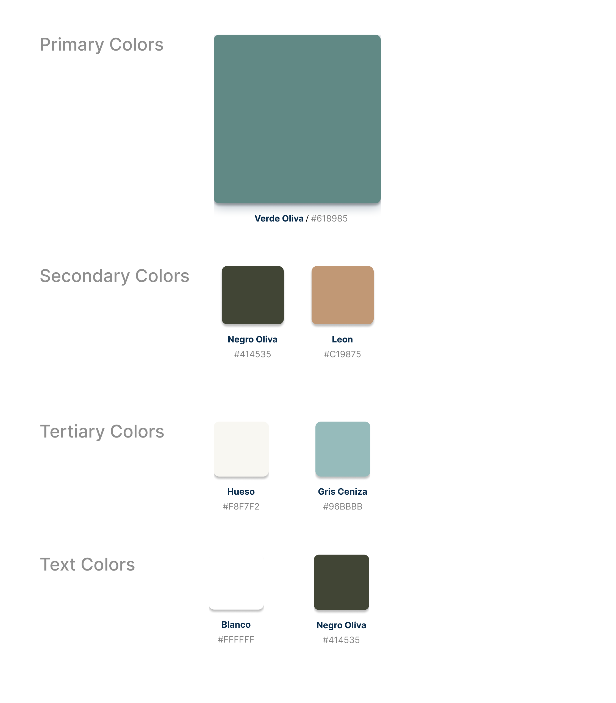

- Color de Botones: 
Oscuro:
`#414535` 
Claro:
`#F8F8F8` 

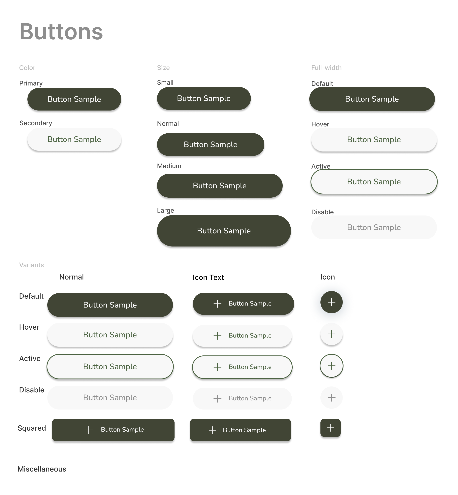

**Tipografía:**

La tipografía define la jerarquía visual y la legibilidad de la plataforma. Se han definido los siguientes estilos:

- **Heading 01:** Montserrat SemiBold – 52px
- **Heading 02:** Montserrat Medium – 36px
- **Heading 03:** Arial Nova Bold – 24px
- **Heading 04:** Arial Nova Regular – 18px
- **Texto principal:** Arial Nova Regular – 16px
- **Texto técnico:** Roboto Mono – 14px

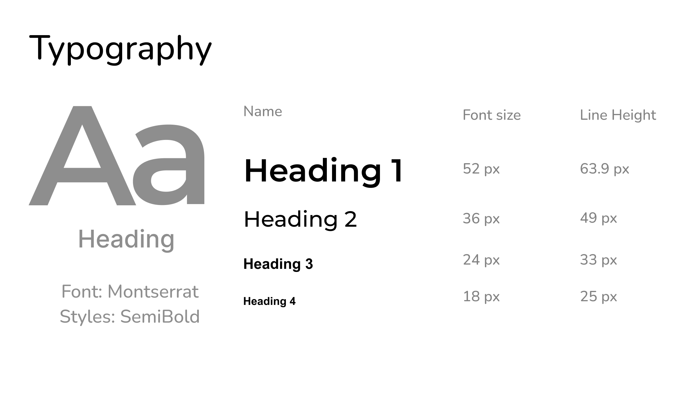


**Tono de comunicación:**
- Profesional pero cercano.
- Técnico, sin perder accesibilidad.
- Entusiasta y claro.
### 4.1.2. Web Style Guidelines
El enfoque de diseño web de Cafelab es limpio, moderno y centrado en la eficiencia operativa. El estilo busca balancear datos técnicos complejos con una experiencia visualmente amigable.

**Tarjetas y visualizaciones:**

- Se usan componentes visuales como "cards" para representar lotes, tuestes, recetas y catas.
- Visualizaciones clave como curvas de tueste y hexágonos sensoriales están integradas con alto contraste y claridad.
- Cada módulo se presenta con íconos representativos del proceso (tueste, molienda, método, etc.).

**Botones:**

- Botones primarios: Redondeados, fondo color negro oliva, texto blanco.
- Botones secundarios: Bordeados, fondo transparente, texto café.
- Uso de color rojo `#D32F2F` para acciones destructivas (eliminar lote, cancelar proceso).

**Tablas:**

- Las tablas muestran listas de lotes, tuestes, recetas o usuarios.
- Diseño limpio, encabezados destacados, intercalado de filas para facilitar la lectura.
- Columnas ordenables y con íconos de filtrado.

**Pantallas emergentes:**

- Pop-ups propios (no de navegador) para confirmación de acciones importantes.
- Fondo oscuro atenuado y foco visual centrado.
- Botones de acción y cierre claramente visibles.
## 4.2. Information Architecture
La arquitectura de información de Cafelab ha sido diseñada para guiar al usuario de forma lógica, eficiente y contextual a través de todas las funcionalidades de la plataforma. Cada módulo ha sido organizado con el objetivo de representar las etapas del proceso del café desde su estado verde hasta la taza final. Se busca facilitar tanto el registro de información técnica como su posterior análisis para toma de decisiones, con una experiencia fluida, clara y estructurada.

A continuación, se detallan los sistemas de organización, etiquetado, navegación, búsqueda y posicionamiento web considerados para garantizar una experiencia digital de calidad.

### 4.2.1. Organization Systems.
La organización del contenido en Cafelab ha sido diseñada teniendo en cuenta las distintas etapas del proceso del café y la variedad de perfiles de usuario. A lo largo de la plataforma, se utilizan diferentes tipos de organización visual para facilitar el acceso, comprensión y uso eficiente de las herramientas disponibles.

#### Organización jerárquica (Visual Hierarchy)

La estructura jerárquica se aplica principalmente en la Landing Page y en los paneles de administración. En estos espacios, se presenta la información de forma descendente según su relevancia, empezando por los valores de la marca, seguido de los beneficios, funcionalidades clave y finalmente los planes disponibles. Los títulos, botones de llamada a la acción y módulos destacados ocupan mayor espacio visual para guiar la atención del usuario. Este tipo de organización también se implementa en vistas como el perfil del barista o administrador, donde los datos personales y funciones de edición están claramente separados, priorizando la información antes que las acciones.

#### Organización secuencial (Step-by-step)

En procesos técnicos como el registro de una curva de tueste, la calibración de una receta o una sesión de cata, la aplicación guía al usuario paso a paso. El flujo está diseñado para que cada acción derive lógicamente en la siguiente, permitiendo una documentación completa y estructurada. Por ejemplo, en el registro de tueste, el usuario primero indica el lote, luego los parámetros técnicos, seguido por la curva de temperatura y finaliza con la comparación o guardado del perfil. Esta secuencia reduce errores y facilita la repetibilidad de procesos complejos.

#### Organización matricial

El panel de inicio (Dashboard) utiliza una organización matricial que permite al usuario tener una vista general del estado actual de su operación. En esta interfaz, se combinan tarjetas interactivas, indicadores visuales, gráficas e hipervínculos que llevan directamente a los módulos de tueste, cata, recetas o inventario. Esta disposición permite acceder rápidamente a áreas específicas sin necesidad de recorrer un camino lineal. La interfaz es especialmente útil para administradores que requieren monitoreo y toma de decisiones rápidas.

#### Categorización del contenido

Según el tipo de información y su propósito dentro de la plataforma, se aplican distintas formas de categorización:

- **Alfabética:** Utilizada en listados de métodos de preparación, variedades de café o recetas personalizadas. Facilita la localización rápida de elementos en bibliotecas extensas.
- **Cronológica:** Aplicada en historiales de cata, curvas de tueste y registros de inventario. Esta categorización es esencial para el análisis de evolución de lotes y procesos a lo largo del tiempo.
- **Por tópicos:** Implementada en la segmentación del contenido educativo, artículos técnicos o secciones informativas dentro del dashboard.
- **Según audiencia:** La plataforma adapta su contenido de inicio según el tipo de usuario. Por ejemplo, un administrador accede directamente al panel general con estadísticas e inventario, mientras que un barista profesional inicia en la vista de tuestes activos o próximas calibraciones.

Esta combinación de sistemas de organización permite que Cafelab ofrezca una experiencia flexible y funcional, respetando tanto la lógica del proceso cafetalero como las necesidades específicas de sus distintos usuarios.
### 4.2.2. Labeling Systems.
El sistema de etiquetado de Cafelab busca maximizar la claridad y minimizar la carga cognitiva del usuario mediante un lenguaje directo, técnico y específico del rubro cafetalero.

 Uso de etiquetas precisas, técnicas y consistentes: "Curva de Tueste", "Perfil Sensorial", "Lote #xxx", "Ratio", "Taza".
- Etiquetas breves en menús: `Inicio`, `Tueste`, `Cata`, `Recetas`, `Inventario`.
- Tarjetas y gráficos etiquetados con íconos + texto para facilitar el reconocimiento visual.
### 4.2.3. SEO Tags and Meta Tags
Los meta tags y SEO tags son elementos clave para mejorar el posicionamiento de la aplicación en motores de búsqueda, facilitar la indexación y enriquecer la experiencia en plataformas de redirección o previsualización (como redes sociales y navegadores). En Cafelab, estos elementos están optimizados tanto para la Landing Page como para la Web App una vez iniciada sesión.

**Landing Page:**
- Etiqueta de título: 
Utilizada para la lectura de los motores de búsqueda en los encabezados de las distintas páginas.
```html
<title>Cafelab – Dominio total sobre tu café</title>
```
```html
<title>Cafelab | Panel de Control</title>
```
- Etiqueta configuración de caracteres: 
Muestra correctamente los caracteres del alfabeto castellano.
```html
<meta charset="utf-8">
```
- Etiqueta de descripción: 
Nos sirve para que el motor de búsqueda tenga un resumen del contenido de la página. 

```html
<meta name="description" content="Plataforma integral para baristas y cafeterías que conecta el café verde con la taza final. Documenta, calibra y escala tu calidad.">
```
```html
<meta name="description" content="Gestión completa de tus tuestes, recetas y procesos desde un solo lugar.">

```
- Etiqueta de palabras clave: 
Utilizada para la lectura de los motores de búsqueda en los encabezados de las distintas páginas.
```html
<meta name="keywords" content="café de especialidad, barista, tueste, cata, trazabilidad, calibración, cafelab">
```
```html
<meta name="keywords" content="panel de tueste, perfil sensorial, barista app, café verde, recetas de café">
```
-  Etiqueta de autor y derechos de autor: 
Etiqueta que nos permite registrar la autoría de la página.
```html
<meta name="author" content="Equipo Cafelab - CafeMetrix">
<meta name="copyright" content="cafelab"/>
```


### 4.2.4. Searching Systems.
Los sistemas de búsqueda de Cafelab están diseñados para que el usuario pueda encontrar información específica de manera ágil, incluso dentro de grandes volúmenes de datos históricos o múltiples lotes activos.
- Búsqueda por texto: En tuestes, recetas, catas y lotes.
- Filtros combinables: Método de preparación, origen del grano, fecha, variedad.
- Resultados con etiquetas visuales (tipo de café, método, fecha) y opciones para ordenar y comparar.
### 4.2.5. Navigation Systems.
Los sistemas de navegación de Cafelab permiten al usuario recorrer los diferentes módulos y procesos de forma estructurada, intuitiva y adaptativa al dispositivo utilizado.

- Menú lateral fijo (web desktop): Accesos a los principales módulos.
- Menú hamburguesa (responsive): Versión simplificada para móviles.
- Barra superior contextual: Con accesos rápidos a perfil, notificaciones, ayuda.
- Flujo secuencial: Registro paso a paso para tuestes y catas.
- Breadcrumbs: En vistas de detalle, para mantener contexto.
- Call To Action claros: “Registrar nuevo tueste”, “Crear receta”, “Ver historial”.
## 4.3. Landing Page UI Design.
### 4.3.1. Landing Page Wireframe.
**Landing Page para Desktop Web Browser**
La versión wireframe de nuestra landing page presenta una estructura básica compuesta por diversos elementos fundamentales. En la parte superior se ubica la navegación principal representada mediante bloques simples que indican secciones como Beneficios, Planes, Contáctanos, Iniciar sesión y el selector de idioma. Las visualizaciones de datos se representan mediante áreas designadas para dashboards y gráficos, utilizando rectángulos con líneas básicas en su interior. Asimismo, los planes de suscripción se organizan en una cuadrícula de cuatro tarjetas, cada una como un rectángulo con espacios para encabezados y listas de características. Finalmente, la sección de testimonios se muestra con bloques para imágenes de perfil y áreas de texto para citas.

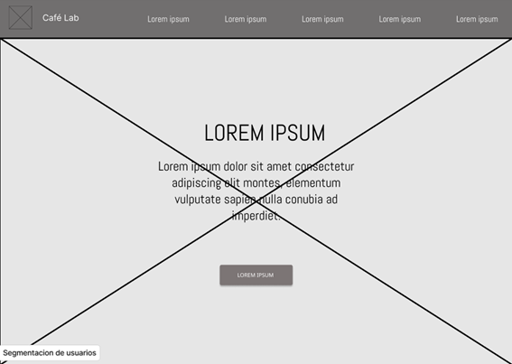
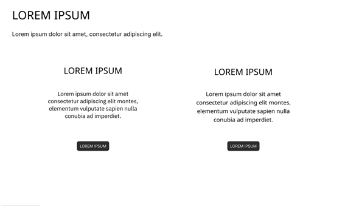
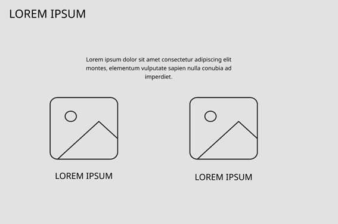
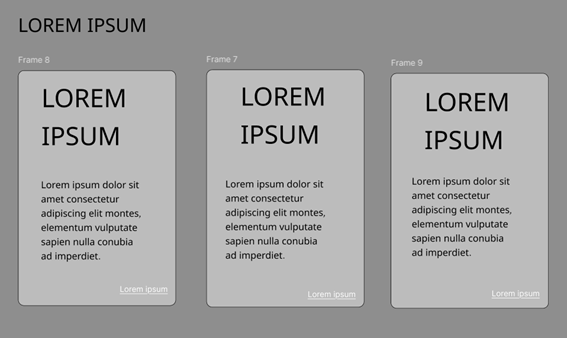
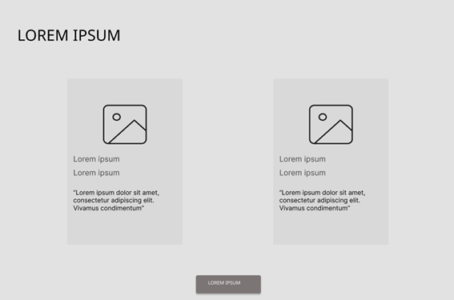
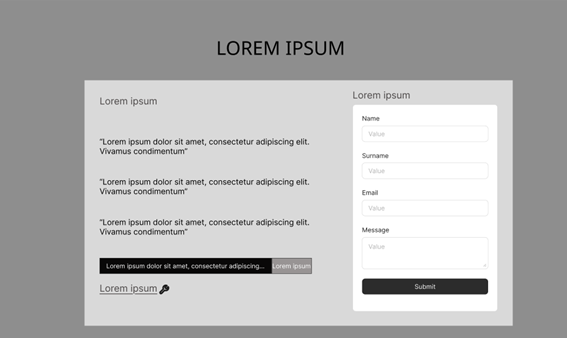
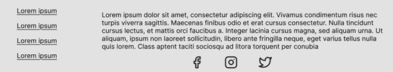

**Landing Page para Mobile Web Browser**
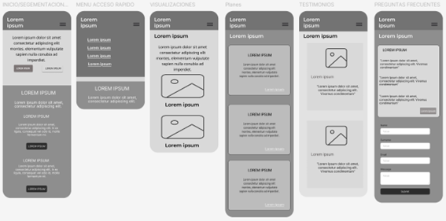
### 4.3.2. Landing Page Mock-up.
**Landing Page para Desktop Web Browser**
En nuestra versión mock-up se evidencia la implementación de los elementos de diseño específicos de Café Lab. Se aplicó la paleta de colores característica, que incluye tonos tierra y marrones cálidos como color primario, junto con verdes oscuros como color secundario, creando una estética que evoca la naturaleza del café y su proceso artesanal. La tipografía seleccionada se implementó de manera consistente en todos los elementos de texto, desde los encabezados principales hasta los párrafos descriptivos y botones de acción.

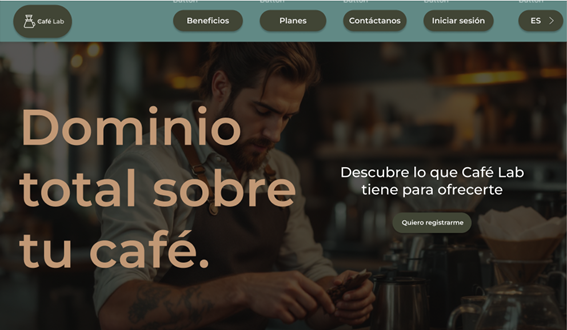
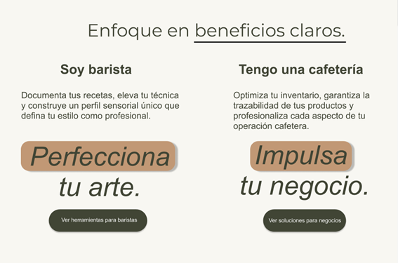
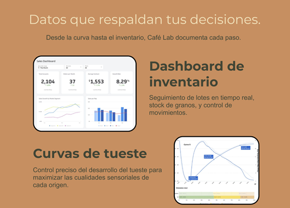
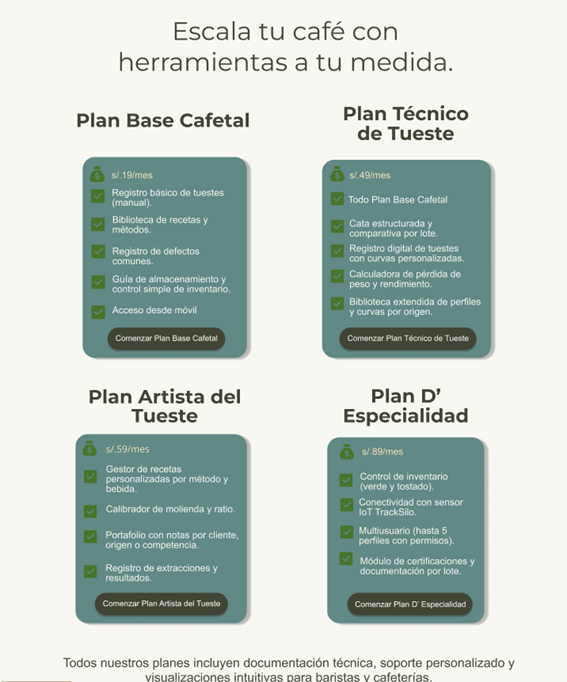
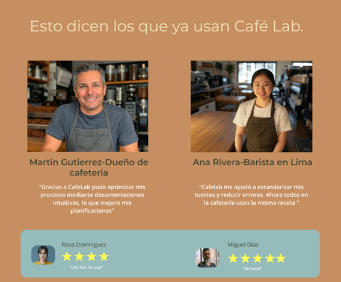
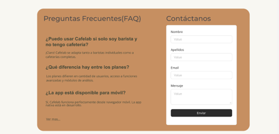
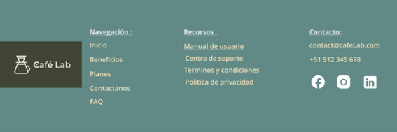

**Landing Page para Mobile Web Browser**
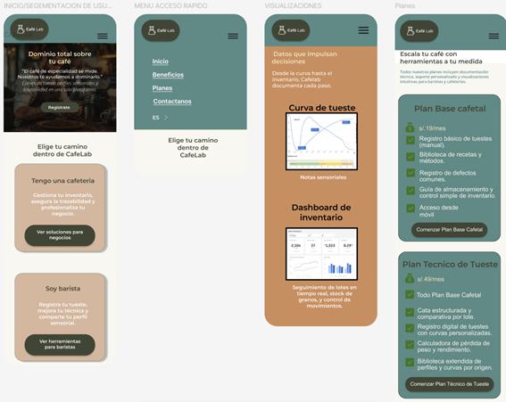
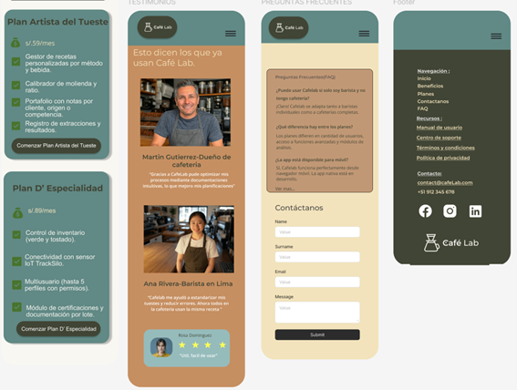

## 4.4. Web Applications UX/UI Design.
### 4.4.1. Web Applications Wireframes.

Sign Up - Bar - US01


Sign Up - Owner - US01


Message after correct Sign Up - US01


Message after correct Sign Up - US01


Sign In - US01


Message after incorrect Sign In - US01


Message after correct Sign In - US01


Select Suscription - US03


Payment - US?


User Profile - US02


Welcome - US?


Suppliers - US04


Supplier Registration - US04


Supplier Edition - US04


Supplier Information - US04


Coffee Lot - US05 y US06


Coffee Lot Registration - US05 y US06


Coffee Lot Edition - US05 y US06


Coffee Lot Information - US04


Roast Profiles - US07


Roast Profiles - US07


Roast Profiles Registration - US07


Roast Edition - US07


Favorite Profiles Filter - US07


Visualize a Roast Profile - US07


Roast Comparison - US09


Cupping Sesions


Cupping Sessions Filters - US11


Cupping Sessions Registration - US11


Cupping Session Sensory Hexagon - US12


Compare multiple Cupping Sessions 1 - US12


Compare multiple Cupping Sessions 2 - US12


Library Defect Consultation - US10


Defect Information - US10


Patterns of Roast with Cupping - US13


Library Relation of Roast with Cupping - US13


Portfolio and recipies - US15 and 17


Recipes - US17


Recipe Registration coffee extraction - US15


Recipe Registration espresso method - US15


Recipe Information coffee extraction - US18


Recipe Information espresso method - US18


Record Grind Calibration - US16


Calibration record


edit calibration


Inventary - US19


Inventary - US19


Register Production Cost Management 1 - US20


Production Cost Management 2 - US20


Production Cost Management 3 - US20


Production Cost Management 4 - US20


Production Cost Management 5 - US20


### 4.4.2. Web Applications Wireflow Diagrams.
### 4.4.2. Web Applications Mock-ups.

Select Suscription - US03

Select Payment - US?

Sing Up - Bar US01

Message after correct Sign Up - US01

Sign In - US01

Message after correct Sign In - US01

Message after incorrect Sign In - US01

Sign Up - Owner - US01

Message after correct Sign Up - US01

Sing in - Owner

Message after incorrect Sign In - US01

Message after correct Sign In - US01


User Profile - US02


Welcome - US?

Suppliers - US04

Supplier Registration - US04

Supplier Edition - US04

Supplier Information - US04


Coffee Lot - US05 y US06

Coffee Lot Registration - US05 y US06

Coffee Lot Edition - US05 y US06

Coffee Lot Information - US04


Roast Profiles - US07

Roast Profiles - US07

Roast Profiles Registration - US07

Roast Edition - US07

Favorite Profiles Filter - US07

Visualize a Roast Profile - US07

Roast Comparison - US09


Cupping Sessions - US11

Cupping Sessions Filters - US11

Cupping Sessions Registration - US11

Cupping Session Sensory Hexagon - US12

Compare multiple Cupping Sessions 1 - US12

Compare multiple Cupping Sessions 2 - US12


Library Defect Consultation - US10

Defect Information - US10

Defect Information - US10


Patterns of Roast with Cupping - US13

Library Relation of Roast with Cupping - US13


Portfolio and recipies - US15 and 18

Portfolio and recipies - US15 and 19

Portfolio and recipies - US15 and 20

Recipes - US17

Recipe Registration - US15

Recipe Registration - US15

Recipe Information coffee extraction - US18

Recipe Information espresso method - US18


Inventary - US19

Inventary - US19


Register Production Cost Management 1 - US20

Production Cost Management 2 - US20

Production Cost Management 3 - US20

Production Cost Management 4 - US20

Production Cost Management 5 - US20


### 4.4.3. Web Applications User Flow Diagrams.
## 4.5. Web Applications Prototyping.
## 4.6. Domain-Driven Software Architecture.

El Domain Driven Design (DDD) busca establecer un entendimiento común del dominio que engloba el espacio del problema, fomentando una mejor colaboración entre desarrolladores y expertos del dominio. Este enfoque no se limita a emplear un lenguaje ubicuo, sino que incluye un conjunto de patrones, procesos y diagramas de la arquitectura del sistema, artefactos diseñados para alinear el software con el dominio y fortalecer la perspectiva compartida que promueve DDD.

### 4.6.1. Software Architecture Context Diagram.


### 4.6.2. Software Architecture Container Diagrams.


### 4.6.3. Software Architecture Components Diagrams.

**Log-In Bounded Context**


**Companies Bounded Context**


**Crop Bounded Context**


## 4.7. Software Object-Oriented Design.
### 4.7.1. Class Diagrams.


### 4.7.2. Class Dictionary.

<table border="1" cellpadding="8" cellspacing="0" style="border-collapse: collapse; width: 100%;">
    <tr>
        <th colspan="7" style="text-align:center; border: 1px solid #000;">CaféLab Class Dictionary (Actualizado)</th>
    </tr>
    <tr>
        <th style="text-align:center; border: 1px solid #000;">Class</th>
        <th style="text-align:center; border: 1px solid #000;">Bounded Context</th>
        <th style="text-align:center; border: 1px solid #000;">Entity/Value Object</th>
        <th style="text-align:center; border: 1px solid #000;">Description</th>
        <th style="text-align:center; border: 1px solid #000;">Attributes</th>
        <th style="text-align:center; border: 1px solid #000;">Methods</th>
        <th style="text-align:center; border: 1px solid #000;">Relationships</th>
    </tr>
    <!-- USER MANAGEMENT -->
    <tr>
        <td style="border: 1px solid #000;"><strong>User</strong></td>
        <td style="border: 1px solid #000;">User Management</td>
        <td style="border: 1px solid #000;">Entity</td>
        <td style="border: 1px solid #000;">Represents a user of the CaféLab system (e.g., barista or café owner).</td>
        <td style="border: 1px solid #000;">
            - id: String<br>
            - email: String<br>
            - password: String<br>
            - name: String<br>
            - role: String<br>
            - experience: String<br>
            - plan: Plan
        </td>
        <td style="border: 1px solid #000;">
            - register()<br>
            - authenticate()<br>
            - updateProfile()
        </td>
        <td style="border: 1px solid #000;">
            - 1 to 0..1 Plan: subscribes to<br>
            - 1 to 0..* Supplier: manages<br>
            - 1 to 0..* RoastProfile: creates<br>
            - 1 to 0..* Recipe: creates<br>
            - 1 to 0..* GrindCalibration: documents<br>
            - 1 to 0..* Beverage: creates<br>
            - 0..* StatusUpdate: responsible for
        </td>
    </tr>
    <tr>
        <td style="border: 1px solid #000;"><strong>Plan</strong></td>
        <td style="border: 1px solid #000;">User Management</td>
        <td style="border: 1px solid #000;">Entity</td>
        <td style="border: 1px solid #000;">Represents a subscription plan for CaféLab users.</td>
        <td style="border: 1px solid #000;">
            - id: String<br>
            - name: String<br>
            - price: Float<br>
            - features: List of String
        </td>
        <td style="border: 1px solid #000;">
            - getFeatures()
        </td>
        <td style="border: 1px solid #000;">
            - 0..1 to 1 User: subscribed by
        </td>
    </tr>
    <!-- GREEN COFFEE MANAGEMENT -->
    <tr>
        <td style="border: 1px solid #000;"><strong>Supplier</strong></td>
        <td style="border: 1px solid #000;">Green Coffee Management</td>
        <td style="border: 1px solid #000;">Entity</td>
        <td style="border: 1px solid #000;">Represents a supplier of green coffee.</td>
        <td style="border: 1px solid #000;">
            - id: String<br>
            - name: String<br>
            - location: String<br>
            - contact: String<br>
            - coffeeTypes: List of String<br>
            - evaluations: List of Float
        </td>
        <td style="border: 1px solid #000;">
            - addEvaluation()<br>
            - getAverageEvaluation()
        </td>
        <td style="border: 1px solid #000;">
            - 1 to 0..* CoffeeLot: provides
        </td>
    </tr>
    <tr>
        <td style="border: 1px solid #000;"><strong>CoffeeLot</strong></td>
        <td style="border: 1px solid #000;">Green Coffee Management</td>
        <td style="border: 1px solid #000;">Entity</td>
        <td style="border: 1px solid #000;">Represents a batch of green coffee.</td>
        <td style="border: 1px solid #000;">
            - id: String<br>
            - traceabilityCode: String<br>
            - origin: String<br>
            - variety: String<br>
            - process: String<br>
            - altitude: Float<br>
            - weight: Float<br>
            - status: String<br>
            - statusUpdates: List of StatusUpdate
        </td>
        <td style="border: 1px solid #000;">
            - updateStatus()<br>
            - generateTraceabilityCode()
        </td>
        <td style="border: 1px solid #000;">
            - 1 to 0..* Certification: has<br>
            - 1 to 0..* RoastSession: used in<br>
            - 1 to 0..* SensoryEvaluation: evaluated in<br>
            - 0..* to 1 Inventory: tracked by<br>
            - 1 to 0..1 Cost: incurs<br>
            - 1 to 0..1 PerformanceAnalysis: analyzed in<br>
            - 1 to 0..1 TraceabilityReport: documented in<br>
            - 0..* to 1 Recipe: associated with
        </td>
    </tr>
    <tr>
        <td style="border: 1px solid #000;"><strong>StatusUpdate</strong></td>
        <td style="border: 1px solid #000;">Green Coffee Management</td>
        <td style="border: 1px solid #000;">Value Object</td>
        <td style="border: 1px solid #000;">Represents a status change event for a coffee lot.</td>
        <td style="border: 1px solid #000;">
            - timestamp: DateTime<br>
            - status: String<br>
            - responsible: User
        </td>
        <td style="border: 1px solid #000;">- None</td>
        <td style="border: 1px solid #000;">
            - 0..* to 1 CoffeeLot: updates<br>
            - 0..* to 1 User: responsible for
        </td>
    </tr>
    <tr>
        <td style="border: 1px solid #000;"><strong>Certification</strong></td>
        <td style="border: 1px solid #000;">Green Coffee Management</td>
        <td style="border: 1px solid #000;">Entity</td>
        <td style="border: 1px solid #000;">Represents a certification of a coffee lot.</td>
        <td style="border: 1px solid #000;">
            - id: String<br>
            - type: String<br>
            - documentation: String<br>
            - lotId: String
        </td>
        <td style="border: 1px solid #000;">
            - validate()
        </td>
        <td style="border: 1px solid #000;">
            - 0..* to 1 CoffeeLot: associated with
        </td>
    </tr>


<tr>
    <td style="border: 1px solid #000;"><strong>SensoryEvaluation</strong></td>
    <td style="border: 1px solid #000;">Sensory Evaluation</td>
    <td style="border: 1px solid #000;">Entity</td>
    <td style="border: 1px solid #000;">Represents a sensory evaluation (tasting) of a roasted coffee lot.</td>
    <td style="border: 1px solid #000;">
        - id: String<br>
        - lotId: String<br>
        - roastSessionId: String<br>
        - attributes: Map of String to Float<br>
        - scores: Map of String to Float<br>
        - timestamp: DateTime
    </td>
    <td style="border: 1px solid #000;">
        - generateProfile()<br>
        - compare(other: SensoryEvaluation)
    </td>
    <td style="border: 1px solid #000;">
        - 0..* to 1 CoffeeLot: evaluated in<br>
        - 0..* to 1 RoastSession: evaluated in
    </td>
</tr>

<!-- Preparation -->
<tr>
    <td style="border: 1px solid #000;"><strong>Recipe</strong></td>
    <td style="border: 1px solid #000;">Preparation</td>
    <td style="border: 1px solid #000;">Entity</td>
    <td style="border: 1px solid #000;">Represents a coffee preparation recipe created by a user.</td>
    <td style="border: 1px solid #000;">
        - id: String<br>
        - userId: String<br>
        - name: String<br>
        - method: String<br>
        - ratio: Float<br>
        - temperature: Float<br>
        - time: Float<br>
        - grindSetting: String<br>
        - lotId: String<br>
        - permissions: List of String
    </td>
    <td style="border: 1px solid #000;">
        - shareWithTeam(permissions: List of String)<br>
        - suggestImprovement(changes: String)
    </td>
    <td style="border: 1px solid #000;">
        - 0..* to 1 User: created by<br>
        - 0..* to 1 CoffeeLot: associated with
    </td>
</tr>

<tr>
    <td style="border: 1px solid #000;"><strong>GrindCalibration</strong></td>
    <td style="border: 1px solid #000;">Preparation</td>
    <td style="border: 1px solid #000;">Entity</td>
    <td style="border: 1px solid #000;">Represents a grind calibration for coffee preparation.</td>
    <td style="border: 1px solid #000;">
        - id: String<br>
        - userId: String<br>
        - equipment: String<br>
        - grindSetting: String<br>
        - timestamp: DateTime<br>
        - image: String<br>
        - extractionTime: Float
    </td>
    <td style="border: 1px solid #000;">
        - compareWith(other: GrindCalibration)
    </td>
    <td style="border: 1px solid #000;">
        - 0..* to 1 User: documented by
    </td>
</tr>

<tr>
    <td style="border: 1px solid #000;"><strong>Beverage</strong></td>
    <td style="border: 1px solid #000;">Preparation</td>
    <td style="border: 1px solid #000;">Entity</td>
    <td style="border: 1px solid #000;">Represents a beverage created by a user in their portfolio.</td>
    <td style="border: 1px solid #000;">
        - id: String<br>
        - userId: String<br>
        - name: String<br>
        - category: String<br>
        - ingredients: List of String<br>
        - method: String<br>
        - presentation: String<br>
        - photo: String
    </td>
    <td style="border: 1px solid #000;">
        - categorize(category: String)
    </td>
    <td style="border: 1px solid #000;">
        - 0..* to 1 User: created by
    </td>
</tr>

<!-- Administration -->
<tr>
    <td style="border: 1px solid #000;"><strong>Inventory</strong></td>
    <td style="border: 1px solid #000;">Administration</td>
    <td style="border: 1px solid #000;">Entity</td>
    <td style="border: 1px solid #000;">Represents the inventory of green and roasted coffee.</td>
    <td style="border: 1px solid #000;">
        - id: String<br>
        - items: Map of CoffeeLot to Float<br>
        - movements: List of Movement<br>
        - alerts: List of String
    </td>
    <td style="border: 1px solid #000;">
        - updateStock(lot: CoffeeLot, quantity: Float)<br>
        - generateAlert()
    </td>
    <td style="border: 1px solid #000;">
        - 1 to 0..* CoffeeLot: tracks<br>
        - 0..* to 1 Movement: has
    </td>
</tr>

<tr>
    <td style="border: 1px solid #000;"><strong>Movement</strong></td>
    <td style="border: 1px solid #000;">Administration</td>
    <td style="border: 1px solid #000;">Value Object</td>
    <td style="border: 1px solid #000;">Represents an inventory movement (addition or subtraction).</td>
    <td style="border: 1px solid #000;">
        - timestamp: DateTime<br>
        - lotId: String<br>
        - quantity: Float<br>
        - type: String
    </td>
    <td style="border: 1px solid #000;">
        - None
    </td>
    <td style="border: 1px solid #000;">
        - 0..* to 1 Inventory: belongs to<br>
        - 0..* to 1 CoffeeLot: affects
    </td>
</tr>

<tr>
    <td style="border: 1px solid #000;"><strong>Cost</strong></td>
    <td style="border: 1px solid #000;">Administration</td>
    <td style="border: 1px solid #000;">Entity</td>
    <td style="border: 1px solid #000;">Represents the cost structure associated with a coffee lot.</td>
    <td style="border: 1px solid #000;">
        - id: String<br>
        - lotId: String<br>
        - categories: Map of String to Float<br>
        - totalCost: Float<br>
        - costPerKilo: Float<br>
        - costPerCup: Float<br>
        - margin: Float
    </td>
    <td style="border: 1px solid #000;">
        - calculateMetrics()
    </td>
    <td style="border: 1px solid #000;">
        - 0..1 to 1 CoffeeLot: associated with
    </td>
</tr>

<tr>
    <td style="border: 1px solid #000;"><strong>PerformanceAnalysis</strong></td>
    <td style="border: 1px solid #000;">Administration</td>
    <td style="border: 1px solid #000;">Entity</td>
    <td style="border: 1px solid #000;">Represents the performance analysis of a coffee lot production process.</td>
    <td style="border: 1px solid #000;">
        - id: String<br>
        - lotId: String<br>
        - metrics: Map of String to Float
    </td>
    <td style="border: 1px solid #000;">
        - compareWith(other: PerformanceAnalysis)
    </td>
    <td style="border: 1px solid #000;">
        - 0..1 to 1 CoffeeLot: associated with
    </td>
</tr>

<tr>
    <td style="border: 1px solid #000;"><strong>TraceabilityReport</strong></td>
    <td style="border: 1px solid #000;">Administration</td>
    <td style="border: 1px solid #000;">Entity</td>
    <td style="border: 1px solid #000;">Represents a traceability report for a coffee lot.</td>
    <td style="border: 1px solid #000;">
        - id: String<br>
        - lotId: String<br>
        - chainDetails: String<br>
        - commercialSheet: String
    </td>
    <td style="border: 1px solid #000;">
        - generateCommercialSheet()
    </td>
    <td style="border: 1px solid #000;">
        - 0..1 to 1 CoffeeLot: documented for
    </td>
</tr>
<!-- Landing Page -->
<tr>
    <td style="border: 1px solid #000;"><strong>ContactForm</strong></td>
    <td style="border: 1px solid #000;">Landing Page</td>
    <td style="border: 1px solid #000;">Entity</td>
    <td style="border: 1px solid #000;">Represents a contact form submission from the landing page.</td>
    <td style="border: 1px solid #000;">
        - id: String<br>
        - name: String<br>
        - email: String<br>
        - message: String<br>
        - timestamp: DateTime
    </td>
    <td style="border: 1px solid #000;">
        - sendConfirmation()
    </td>
    <td style="border: 1px solid #000;">
        - None (standalone entity)
    </td>
</tr>

</table>

</table>


## 4.8. Database Design.
El diseño de base de datos es el proceso de organizar y estructurar los datos en un sistema, creando tablas, relaciones y reglas para garantizar eficiencia, integridad y facilidad de acceso. Este diseño asegura que los datos se almacenen de manera coherente y sean fáciles de gestionar, consultar y mantener a medida que el sistema crece y evoluciona.
### 4.8.1. Database Diagram.


# Capítulo V: Product Implementation, Validation & Deployment

## 5.1. Software Configuration Management.
### 5.1.1. Software Development Environment Configuration.

#### Project Management

1. Trello: Para gestión general los sprints, tareas del equipo, etc.
- Link: [Trello](https://trello.com/b/diGtoNBa/sprint-1)

#### Product UX/UI Design:

1. Figma: Para diseños como Wireframes, Mockups, Prototypes, etc) relacionados a archivos como 
- Link: [Figma](https://www.figma.com/design/ac0fpdPl6fqEDpJxCEYlY0/CafeLab?node-id=0-1&t=lA86yZwaDqrxsCcw-1)


2. Vertabelo: Para diagramas de base de datos (ERD, diagramas de clases, etc.)
- Link: [Vertabelo](https://my.vertabelo.com/doc/G0Q82VsUEPCKHm23nIWxEd2E7wvZqifm)

#### Software Development:
1. Visual Studio Code: Para el desarrollo de la Landing Page del proyecto.
- **Link:** [LandingPage]()

#### Software Documentation:

1. Visual Studio Code: Para la documentación de CaféLab se utilizó Visual Studio Code para el desarrollo de los capítulos en formato Markdown.
- **Link:** [Documentation](https://github.com/upc-pre-202510-1asi0729-4307-CafeMetrix/cafeLab)


### 5.1.2. Source Code Management.
Para todo el desarrollo de CaféLab se usará el flujo de trabajo de Gitflow.
Landing Page Repository: [Landing Page Repository](https://github.com/1ASI0730-2510-4370-G2-Youper/Landing-Page)


**Flujo de trabajo GitFlow:** El flujo de trabajo Git Flow fue  planteado por Vincent Driessen en "A successful Git branching model".

### Main branch
La rama principal (main) es donde se mantiene el código más estable y desplegado.

### **Develop branch**
La rama develop actúa como el área principal donde se integran los últimos avances y correcciones antes de hacerles merge a master.

### **Release branch**
Las ramas release facilitan la preparación para una nueva versión del producto. Nos permiten aplicar correcciones menores en caso de imprevistos mientras develop sigue recibiendo nuevas funcionalidades.
- Deriva de: develop
- Se fusiona en: develop y master


### **Feature branch**
Las ramas feature son utilizadas para desarrollar nuevas funcionalidades o mejoras específicas. Cada característica se desarrolla de forma aislada hasta estar lista para integrarse.
- Deriva de: develop
- Se fusiona de regreso a: develop


### **Hotfix branch**
Las ramas hotfix se crean para corregir errores críticos detectados en producción, asegurando una reacción rápida sin interrumpir el trabajo de desarrollo continuo.
- Deriva de: master.
- Se fusiona en: master y develop.


### **Conventional Commits**
Aplicamos la convención **Conventional Commits** para redactar mensajes de commit claros, consistentes y semánticos. Esta práctica facilita el rastreo de cambios, la generación automática de registros de cambios y mejora la colaboración en equipo.

La estructura recomendada para los mensajes es:

~~~
git commit -m “<type>[optional scope]: <title>“ -m “<description”
~~~
**Tipos De Conventional Commits**
~~~
1. feat: Para introducir una nueva funcionalidad.
2. fix: Para corregir un error existente.
3. docs: Cambios relacionados a la documentación.
4. style: Modificaciones de formato que no afectan el comportamiento del código.
5. refactor: Reestructuraciones internas sin cambios funcionales o correcciones de errores.
6. test: Agregado o modificación de pruebas.
7.chore: Tareas de mantenimiento o cambios que no afectan el código de producción.
8. perf: Mejoras de rendimiento.
~~~

### 5.1.3. Source Code Style Guide & Conventions.

Todo el código de la solución deberá ser escrito completamente en inglés para mantener la consistencia internacional y facilitar su mantenimiento.

**HTML**

- Emplear nombres de etiquetas y atributos en minúscula.
- Cerrar correctamente todas las etiquetas HTML.
- Especificar siempre los atributos `alt`, `width`, y `height` para imágenes para mejorar la accesibilidad.
- Evitar espacios innecesarios en los atributos HTML.

**CSS**

- Asignar nombres de IDs y clases descriptivos que reflejen el propósito del elemento.
- Utilizar nombres cortos pero claros para IDs y clases.
- Aplicar propiedades abreviadas cuando sea posible para optimizar el código.
- Evitar el uso de unidades después de valores de cero (`0`).
- Ordenar las declaraciones CSS en orden alfabético para facilitar su lectura.

**JavaScript**

- Mantener una sintaxis expandida: llaves de apertura en la misma línea de la declaración, cierre en línea nueva.
- Aplicar `lowerCamelCase` en el nombramiento de variables y funciones.
- Usar `let` y `const` para declarar variables en lugar de `var`.
- Asegurar que los nombres de las funciones sean descriptivos y en `lowerCamelCase`.

**Lenguaje Gherkin**

- Redactar títulos descriptivos y concisos para escenarios (`Feature`, `Scenario`).
- Respetar estrictamente la estructura `Given-When-Then`.
- Usar un lenguaje orientado al negocio, entendible para todos los stakeholders, evitando detalles técnicos.
- Implementar `Scenario Outline` cuando existan múltiples casos similares.
- Agregar comentarios cuando se requiera contexto o explicaciones adicionales.

### 5.1.4. Software Deployment Configuration

#### Landing Page Deployment

Para desplegar la landing page, debemos contar con una cuenta de GitHub, así como tener acceso como administrador del repositorio del proyecto. De esta forma, podemos cargar los documentos trabajados localmente al repositorio y posteriormente desplegarlos. A continuación, se muestran los pasos realizados:

1. **Crear ramas** donde los miembros del proyecto puedan subir sus respectivas secciones.
2. **Organizar la estructura del proyecto** para una adecuada administración de los documentos y mejor visualización:
   - `index.html`: contiene el código principal.
   - Carpeta `assets/css`: para los estilos.
   - Carpeta `img`: para las imágenes adecuadamente enlazadas en `index.html`.
   - Archivos `.js`: para funcionalidades JavaScript si el proyecto lo requiere.
3. **Subir los archivos al repositorio**:
   - Instalar Git.
   - Configurar el repositorio remoto.
   - Ejecutar los comandos necesarios para realizar commits y push de los cambios a la rama correspondiente.
4. **Configurar la página de despliegue**:
   - Realizar un pull request sin errores hacia la rama `main`.
   - Garantizar que el despliegue pueda modificarse adecuadamente si es necesario.
5. **Resolver conflictos**:
   - En caso de conflictos, corregirlos usando herramientas como Visual Studio Code.
   - Verificar que todos los conflictos hayan sido solucionados correctamente.

Una vez cumplidos estos pasos, iniciamos sesión en [Netlify](https://www.netlify.com/), plataforma que utilizaremos para el despliegue de la landing page, conectando el repositorio de GitHub para un despliegue seguro y que permita futuras actualizaciones sin afectar el Front End.

🔗 **Landing Page en Netlify**: [https://cafelab-landingpage-appweb-upc.netlify.app/](https://cafelab-landingpage-appweb-upc.netlify.app/)

---

#### Front End Web Application Deployment

1. Iniciamos sesión en Netlify y vinculamos nuestro repositorio.  
   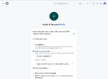
2. Verificamos que se haya permitido el acceso y seleccionamos el proyecto que deseamos desplegar.  
   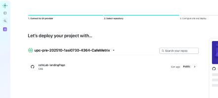
3. Completamos los campos requeridos:
   - Nombre del equipo.
   - Rama donde se encuentran los archivos.
   - Asignamos el nombre de la página.  
   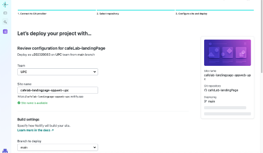
4. Procedemos a desplegar la página.  
   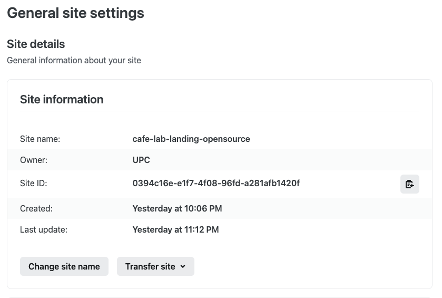
5. Verificamos que el despliegue se haya realizado correctamente en la sección de sitios desplegados de Netlify.  
   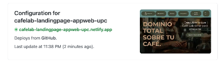

🔗 **Página desplegada en Netlify**: [https://cafelab-landingpage-appweb-upc.netlify.app/](https://cafelab-landingpage-appweb-upc.netlify.app/)


## 5.2. Landing Page, Services & Applications Implementation
### 5.2.1. Sprint 1
#### 5.2.1.1. Sprint Planning 1
#### 5.2.1.2. Aspect Leaders and Collaborators.
En esta sección se presenta la Leadership-and-Collaboration Matrix (LACX), un artefacto clave que define la estructura de responsabilidades para el Sprint actual. Esta matriz identifica claramente quién asume el rol de líder y quiénes actúan como colaboradores en cada aspecto del proyecto, facilitando una comunicación efectiva y una distribución equitativa del trabajo.

| Team Member (Last Name, First Name) | GitHub Username | Información del Producto (US23) | Secciones Específicas por Segmento (US24) | Contacto con Equipo (US25) | Acceso directo a plataforma (US26) |
|-------------------------------------|-----------------|--------------------------------|------------------------------------------|---------------------------|----------------------------------|
| [Donayre], Adrian                  | [adriandonayredev]      | C                              | L                                        | C                         | L                                |
| [Uribe], Renzo                   | [JKOlimpo]      | L                              | C                                        | C                         | C                                |
| [Chavez], Joseph                  | [MrOsoPanda]      | L                              | C                                        | C                         | L                                |
| [Fernández], Fredy                   | [u202320083]      | C                              | L                                        | C                         | C                                |
| [Inga], Christian               | [Christian1905]      | C                              | L                                        | C                         | C                                |

#### 5.2.1.3. Sprint Backlog 1.
Durante el primer sprint, el equipo se propuso iniciar y finalizar la landing page. Para la organización y gestión de sus integrantes, se empleó Trello, lo que facilitó la división de las historias de usuario en tareas más pequeñas y su asignación según las habilidades de cada miembro. A pesar de ello, debido a las limitaciones de tiempo y la acumulación de tareas, no tuvimos la oportunidad de probar al completo todas las historias definidas.

<p align="center">
    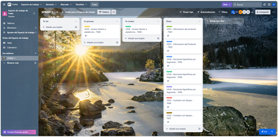
</p>

Link de [Trello](https://trello.com/b/diGtoNBa/sprint-1)

<table>
        <thead>
            <tr>
                <th colspan="2">User Story</th>
                <th colspan="6">Work-Item/Task</th>
            </tr>
            <tr>
                <th>Id</th>
                <th>Title</th>
                <th>Id</th>
                <th>Title</th>
                <th>Description</th>
                <th>Estimation (Hours)</th>
                <th>Assigned To</th>
                <th>Status (To-do / In Process / To Review / Done)</th>
            </tr>
        </thead>
        <tbody>
            <tr>
                <td>US23</td>
                <td>Información del Producto</td>
                <td>TK01</td>
                <td>Configurar proyecto y estructura base</td>
                <td>Crear estructura inicial del proyecto e implementar header con navegación y hero banner principal</td>
                <td>4</td>
                <td>Renzo</td>
                <td>To-do</td>
            </tr>
            <tr>
                <td></td>
                <td></td>
                <td>TK02</td>
                <td>Desarrollar sección "Enfoque en beneficios claros"</td>
                <td>Implementar sección con título y áreas diferenciadas para baristas y cafeterías</td>
                <td>3</td>
                <td>Joseph</td>
                <td>To-do</td>
            </tr>
            <tr>
                <td>US24</td>
                <td>Secciones Específicas por Segmento</td>
                <td>TK03</td>
                <td>Implementar secciones para baristas y cafeterías</td>
                <td>Crear las áreas "Soy barista" y "Tengo una cafetería" con descripciones y CTAs</td>
                <td>4</td>
                <td>Christian</td>
                <td>To-do</td>
            </tr>
            <tr>
                <td></td>
                <td></td>
                <td>TK04</td>
                <td>Desarrollar sección de datos y gráficos</td>
                <td>Implementar área "Datos que respaldan tus decisiones" con gráficos de dashboard y curvas</td>
                <td>5</td>
                <td>Adrian</td>
                <td>To-do</td>
            </tr>
            <tr>
                <td></td>
                <td></td>
                <td>TK05</td>
                <td>Crear sección de planes y características</td>
                <td>Implementar la comparativa de los 4 planes con precios y listas de características</td>
                <td>5</td>
                <td>Fredy</td>
                <td>To-do</td>
            </tr>
            <tr>
                <td>US25</td>
                <td>Contacto con Equipo</td>
                <td>TK06</td>
                <td>Desarrollar sección de testimonios</td>
                <td>Crear área de testimonios con fotos y citas de usuarios actuales</td>
                <td>3</td>
                <td>Kalet</td>
                <td>To-do</td>
            </tr>
            <tr>
                <td></td>
                <td></td>
                <td>TK07</td>
                <td>Implementar sección FAQ y contacto</td>
                <td>Crear área combinada con preguntas frecuentes y formulario de contacto con validación básica</td>
                <td>4</td>
                <td>Guillermo</td>
                <td>To-do</td>
            </tr>
            <tr>
                <td>US26</td>
                <td>Acceso directo a plataforma</td>
                <td>TK08</td>
                <td>Crear footer y enlaces</td>
                <td>Implementar pie de página con navegación, recursos y contacto</td>
                <td>4</td>
                <td>Joseph</td>
                <td>To-do</td>
            </tr>
            <tr>
                <td></td>
                <td></td>
                <td>TK09</td>
                <td>Optimizar responsive y realizar pruebas</td>
                <td>Asegurar compatibilidad con dispositivos móviles y ejecutar pruebas de funcionamiento</td>
                <td>5</td>
                <td>Adrian</td>
                <td>To-do</td>
            </tr>
        </tbody>
</table>

#### 5.2.1.4. Development Evidence for Sprint Review.


#### 5.2.1.5. Execution Evidence for Sprint Review.
#### 5.2.1.6. Services Documentation Evidence for Sprint Review.
#### 5.2.1.7. Software Deployment Evidence for Sprint Review.
#### 5.2.1.8. Team Collaboration Insights during Sprint.
## 5.3. Validation Interviews.
### 5.3.1. Diseño de Entrevistas.
### 5.3.2. Registro de Entrevistas.
### 5.3.3. Evaluaciones según heurísticas.

## 5.4. Video About-the-Product.

# Conclusiones
## Conclusiones y recomendaciones.
# Video About-the-Team.
# Bibliografía
- **Specialty Coffee Association (SCA).** (2022). *Annual Report: Certification and Professional Development Statistics*. [https://sca.coffee](https://sca.coffee)
- **Euromonitor International.** (2023). *Coffee Shops Market in Latin America*. [https://www.euromonitor.com](https://www.euromonitor.com)
- **Allied Market Research.** (2022). *Specialty Coffee Market by Product Type and Distribution Channel: Global Opportunity Analysis and Industry Forecast, 2021–2027*. [https://www.alliedmarketresearch.com](https://www.alliedmarketresearch.com)
- **International Coffee Organization (ICO).** (2023). *World Coffee Consumption Statistics*. [https://www.ico.org](https://www.ico.org)


# Anexos


